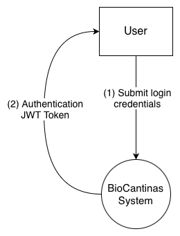
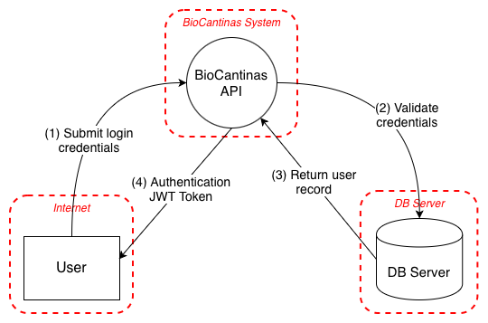
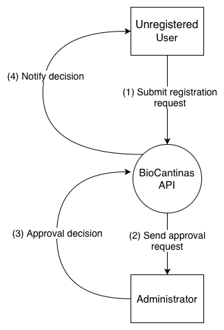
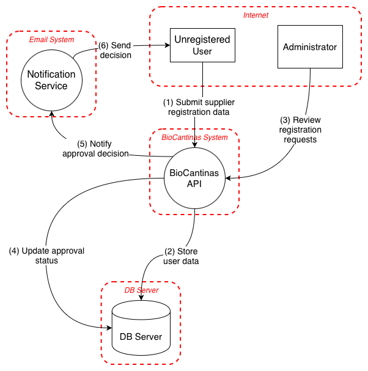

# Phase 1: 

------

## Table of Contents

------

## Introduction

The present report has the purpose to document the application of the first two steps of the Secure Software Development Life Cycle (SSDLC) 
process: Analysis/Requirements and Design, in the system BioCantinas, a software solution to promote healthy eating and 
sustainable food education, to reduce food waste and to help the business of local producers. ´

In the first step of the SSDLC process, it will be done a study on the functional and non-functional requirements, secure development
requirements and use and abuse cases.

The second step evolves around the Threat Modeling analysis that aims to identify, categorize, and recommend mitigations 
for potential security vulnerabilities before they can be exploited in a production environment.

This report also explores matters like a STRIDE-based threat analysis tables with detailed mitigations for the identified threats,
Data Flow Diagrams (DFD) and demonstrations of the Use and Abuse Cases.

To identify and to address the security risks and vulnerabilities in the beginning of the development lifecycle is holds
a great importance and adds value to software development. Trough SSDLC it is possible to a secure and robust platform that protects sensitive data while maintaining
the integrity of the BioCantinas system, preventing potential security breaches and consistency.

## Project Analysis

### Project Description

This project, originally proposed by the Municipality of Cinfães exposes the initiative of the preparation and distribution of meals
prepared with fresh and fully organic products, grown by the local agriculture producers of the municipality. The application, intended to
be used in school and nursing home environments, aims to facilitate the process of supplier contracting,
product procurement, and meal planning. The meals are cooked in Cinfães's central canteen with the organic products
received and then distributed to the other canteens, according to the demand of each one.

BioCantina's main goals are to promote local agriculture business, to encourage healthy eating habits in the community, to
monitor and prevent food waste by providing accurate meal planning and inventory management, and to contribute to the 
sustainability of the local food system.

The application will provide a smooth flow throughout the entire different processes, from the initial meal planning, to the procurement of ingredients, 
to the preparation and distribution of meals to assure an efficient and sustainable system.

### Domain Model

### Component Diagram

This diagram shows the main components of the BioCantinas system and how they interact.

Components:
- BioCantinas System: The main container that groups the application components.
- BioCantinas Backend: Implements business logic (orders, suppliers, meal planning, stock and reservation management). The Backend uses external services and the Database API to access persistent data.
- BioCantinas Frontend: The user-facing application (web or mobile). The Frontend consumes the Backend API to perform operations and also exposes its own API for clients/integrations where applicable.
- External Portal: External system(s) (e.g., School Portal) that the Backend calls via an external API to synchronize or retrieve authoritative data.
- BioCantinas Database: The persistent store (PostgreSQL) that keeps users, suppliers, products, orders, reservations and audit logs. Access is performed via the Database API used by the Backend.

Connections:
- The BioCantinas Frontend calls the Backend API to request operations and retrieve data.
- The BioCantinas Backend calls the External Portal API to synchronize external data and to perform external checks.
- The BioCantinas Backend uses the Database API to read and write data in the BioCantinas Database.
- The Frontend may expose a public or internal API for lightweight integrations or for mobile clients that require a direct interface.

Deployment:
- The system runs with the Backend (API + business logic) and the Frontend (SPA or mobile apps). Both are deployed as services or containers.
- The BioCantinas Database is hosted on a remote server or managed DB service and is accessed securely by the Backend through the Database API.
- External Portal(s) are hosted outside the system and accessed over TLS by the Backend.

### Entry and Exit Points

#### Entry Points
Entry points represent the interfaces through which data enters the system from external sources:

*API Endpoints*
 - Authentication endpoints for user login and password recovery
 - Supplier application endpoints (for unregistered suppliers)
 - Menu management endpoints 
 - Meal reservation endpoints 
 - Delivery management endpoints 
 - Stock management endpoints 
 - Payment and transaction endpoints

*File Upload Interfaces*
 - Supplier certification document upload endpoints 
 - Product or delivery-related document submission endpoints

*Database Connection*
 - Secure connection to the database server
 - Authentication mechanisms for API-to-database communication
 - Encrypted storage of sensitive data (in compliance with GDPR)

#### Exit Points
Exit points represent interfaces through which data leaves the system:

*API Responses*
 - JSON data responses to client requests
 - Authentication tokens issued to authenticated clients
 - Error messages and validation results
 - Success/failure status codes for operations

*Database Operations*
 - SQL queries to store, retrieve, or modify data
 - Database backup operations

*System Logs*
 - API access logs with operation details
 - Security event logs
 - Error and exception logs

### Application Users

*Unregistered User*:
 - User who accesses the platform without authentication.
 - Has limited access to the system functionalities.
 - Can apply to the Supplier Program to become a registered supplier.
 - Cannot access protected areas or personalized features.

*Administrator*:
 - Registered user with full access to the system.
 - Responsible for keeping the system efficient, maintainable, and operational.
 - Manages users, suppliers, and overall system configurations.
 - Oversees platform performance and administrative processes.

*Dietitian*:
 - Registered user responsible for planning weekly meals.
 - Creates and publishes menus on the platform.
 - Ensures menus include nutritional and allergen information.
 - Supports healthy and sustainable meal planning.

*Central Canteen Manager*:
 - Registered user responsible for receiving organic products from suppliers.
 - Manages stock, including product quantities and availability.
 - Oversees meal preparation according to the planned menus.
 - Ensures proper coordination between supply and meal production.

### Use Cases

The Use Cases Diagram below demonstrates the interactions between the actor and the BioCantinas system, reflecting
their roles and responsibilities within the platform.

### Functional Requirements

The functional requirements are grouped by use case and outline the key system functionalities to be implemented.
Each functional requirement represents an action or capability that the system must support in order to accomplish the system needs, according to their roles and permissions.

**UC1: Authenticate in the system**

- REQ1.1: The system must allow users to log in using their email and password.
- REQ1.2: The system must validate user credentials and issue a JWT token upon successful authentication.
- REQ1.3: After 3 failed attempts. the user has to wait 5 minutes before attempting to log in again and receives
an alert notification by email.
- REQ1.4: Whenever a log in for the same account is done on another device an alert notification email is sent.
- REQ1.5: The system must invalidate all sessions after a password change.
- REQ1.6: The system must end the session after 20 minutes of inactivity and require re-authentication.

**UC2: Manage my password**

- REQ2.1: The system must allow users to change their password.
- REQ2.2: When a password is altered, it can not be the same as 5 last passwords before.
- REQ2.3: The system provides the user with an email with a link to recover their password, that is online active for 20 minutes.
- REQ2.4: The password must contain at least 10 characters, including at least one uppercase letter, one number, and one special character.
- REQ2.5: The system obliges the user to alter their password every 6 months.
- REQ2.6: No common passwords are allowed (e.g., "password", "123456", etc.).

**UC3: Send a supplier application**

- REQ3.1: The system must allow every unregistered user to apply (no role is required)
- REQ3.2: The system must validate that the fields of name, NIF, contact information, residence, productive capability and the BIO certificate are filled in and valid.
- REQ3.3: The system must validate that the uploaded BIO certificate is a valid PDF file and does not exceed 5MB in size.
- REQ3.4: The candidate must be a resident of Cinfães, strictly.

**UC4: Approve a supplier application**

- REQ4.1: The system must allow administrators to review pending supplier applications.
- REQ4.2: Only the candidates that have passed the interview phase can be approved by the administrator.
- REQ4.3: After an approval, the system sends an email to the supplier with their email credentials and a link to set up their password, the link is active for 24 hours.
- REQ4.4: After a rejection, the system sends an email to the supplier with the reason for the rejection.

**UC5: Manage meal planning**

- REQ5.1: The system allows the dietitian to alter the weekly meal planning with the other alternative dishes available.
- REQ5.2: The weekly meal planning has to be published by the dietitian a week before of the monday of the week that the meal planning is for.
- REQ5.3: The system allows the dietitian to create new dishes, according to the available stock, season and must follow include protein and side dish.
- REQ5.4: The system always provide five types of dishes: meat, fish, vegetarian, kosher and diet.

**UC6: Order products from suppliers**

- REQ6.1: The system lists, by product, the suppliers that can provide it ordered by inscription date.
- REQ6.2: The system must calculate .... ver com carlos

**UC7: Manage supplier data**

- REQ7.1: The system allows the administrator to view and edit supplier information, such as contact information, residence, and product capability.
- REQ7.2: The system allows the administrator to deactivate a supplier account if necessary.
- REQ7.3: The system allows the supplier to request to update their contact information, residence and product capability, which must be approved by the administrator.

### Non-Functional Requirements

The non-functional requirements define the quality attributes and technical constraints that the **CantinasCinfães** system must satisfy to ensure that the platform is secure, reliable, efficient, and easy to use and maintain. These requirements support the operation of school and nursing home canteens, as well as the interaction between consumers, suppliers, dietitians, canteen managers, and administrators.

#### 1. Performance

The system must provide adequate response times for the main operations, such as user authentication, menu consultation, meal reservation, stock updates, delivery validation, and report generation.

- The backend API must respond to requests in under 3 second under normal operating conditions.
- The system must support at least 100 requests per second in normal production usage.
- The system must remain responsive during peak periods, especially when menus are published or reservation deadlines are close.

#### 2. Availability

The system must be accessible whenever users need to perform operational and planning tasks.

- The platform must be available 24/7, except during scheduled maintenance periods.
- The system must achieve at least 99% availability during regular operating hours.
- Essential functionalities, such as viewing menus, reserving meals, validating deliveries, and consulting stock, must remain available even in case of partial failures.
- The infrastructure must ensure stable operation for all supported schools and nursing homes.

#### 3. Scalability

The system must support future growth in the number of users, canteens, suppliers, reservations, and stored data.

- The architecture must support horizontal scaling of backend services.
- The system must be able to handle up to 3 times the average number of active users without significant performance degradation.
- The platform must support the addition of new schools, nursing homes, and suppliers without major architectural changes.
- Storage and processing capacity must be adjustable according to operational demand.

#### 4. Security

The system must protect personal data, operational data, and payment-related information against unauthorized access and common attacks.

- All communication between client, server, and external systems must be protected through HTTPS/TLS.
- Authentication must use secure session management and expiring tokens.
- The system must enforce role-based access control according to the defined roles:
    - System Administrator
    - Supplier
    - Central Canteen Manager
    - Canteen Manager
    - Dietitian
    - Consumer
- Users must only access the data and operations allowed by their role.
- Passwords must be stored using strong hashing algorithms.
- The system must include protection against common attacks such as:
    - SQL Injection
    - Cross-Site Scripting (XSS)
    - Cross-Site Request Forgery (CSRF)
    - Brute-force login attempts
- The system must comply with GDPR requirements and ensure the protection of personal and sensitive data.

#### 5. Reliability and Integrity

The system must guarantee the correctness, consistency, and persistence of critical operations.

- Operations such as meal reservations, reservation cancellations, delivery validation, stock updates, and payment registration** must be processed reliably.
- Data related to reservations, stock, deliveries, and payments must not be lost in case of partial failures.
- The database must preserve data integrity and ensure correct transactional behavior.
- The system must maintain logs of important events, such as authentication attempts, reservations, delivery acceptance or rejection, stock alerts, and payment updates.
- Historical data must be preserved for auditability, traceability, and reporting purposes.

#### 6. Usability and Accessibility

The system must be easy to use by all stakeholders, including school staff, nursing home staff, suppliers, and consumers.

- The user interface must be clear, intuitive, and easy to navigate.
- The system must support users with different levels of digital literacy.
- Common tasks, such as viewing menus, reserving meals, updating stock, and validating deliveries, must require as few steps as possible.

#### 7. Maintainability

The system must be easy to maintain, extend, and evolve over time.

- The codebase must follow software engineering best practices, including modularity, separation of concerns, and documentation.
- New functionalities, such as additional reports or integrations, must be added without requiring major changes to the existing system.
- The system must support updates with minimal downtime.
- Critical features must be covered by automated tests, including:
    - Unit tests
    - Integration tests
    - Acceptance tests

#### 8. Portability

The system must be deployable in different technical environments and remain compatible with the chosen technologies.

- The backend must be compatible with Linux-based environments.
- The system should support deployment using Docker containers.
- The solution must support deployment in both local and cloud environments.
- The API must follow RESTful principles and use JSON as the main data exchange format.
- The frontend must be compatible with modern web browsers and mobile environments.

#### 9. Monitoring and Alerts

The system must provide operational visibility and support quick identification of issues.

- The system must expose technical and business-related metrics, such as:
    - Response times
    - Error rates
    - Resource usage
    - Number of reservations
    - Delivery events
    - Stock alerts
- The platform must generate alerts for situations such as:
    - Products close to expiration
    - Expired products
    - Minimum stock threshold reached
    - Rejected deliveries
    - Uncollected meals
    - Critical failures in system components
- Logs must be centralized and available for analysis and troubleshooting.
- The monitoring solution should be compatible with tools such as Prometheus and Grafana.

#### 10. Interoperability

The system must support communication with external platforms relevant to the domain.

- The system must support integration with the Student/School Portal for authentication and student-related information.
- The system must support integration with the Government System to retrieve payment-related information.
- All integrations must use secure communication mechanisms and must not compromise the confidentiality or integrity of the system.
- The architecture should support future integrations with supplier databases, certification bodies, or reporting platforms.

### Secure Development Requirements

These are required activities during software development to ensure that the CantinasCinfães application does not contain vulnerabilities.

#### 1. Secure Coding Guidelines
Follow recognized standards such as **OWASP Secure Coding Practices**, **CERT Secure Coding Standards**, or **Microsoft's Secure Coding Guidelines**.
Apply best practices:
* **Strict input validation:** Ensure all data coming from the Mobile and Web Applications is validated, particularly in critical forms like Menu Creation, Meals and Reservations Management, and Stock Operations.
* **Strong authentication and secure session management:** Implement JWT tokens securely to handle User Authentication and Password Recovery across all user roles (students, canteen staff, and suppliers).
* **Proper use of cryptography:** Encrypt sensitive data at rest in PostgreSQL, such as passwords and Payment History.
* **Secure error and exception handling:** Ensure no stack traces or database structures are exposed to the end-user, especially during integrations with the **School Portal**.
* **Principle of least privilege:** Implement strict Role-Based Access Control (RBAC) so that, for example, suppliers can only access the Supplier Application and not the internal Food Waste Monitoring or Reports.

#### 2. Dependency Management
* Monitor third-party libraries and frameworks, particularly **NuGet packages** for the **.NET 8.0 SDK**.
* Quickly update vulnerable dependencies (e.g., PDF generation libraries or PostgreSQL connectors).
* Avoid using unmaintained or suspicious packages.

#### 3. Secure Code Review
Perform security-focused code reviews for all new code and major changes. Use automated tools (e.g., **SonarQube**) to assist but not replace manual review.
Focus areas:
* **Critical components:** JWT authentication, authorization mechanisms, and PostgreSQL data access layers.
* **Common vulnerability patterns:** SQL Injection (especially in dynamic queries for Reports and Performance Indicators), XSS in the Web Application, and CSRF.
* **Business logic errors that could be exploited:** e.g., manipulating the Delivery Reception and Validation process, bypassing payment requirements for Meals, or unauthorized data sync with the **School Portal**.

#### 4. Static Application Security Testing (SAST)
* Use static code analysis tools (e.g., **SonarQube**) integrated directly into the **GitHub Actions** CI/CD pipelines to detect vulnerabilities early in the C# codebase.

#### 5. Secure Build and Deployment
* Ensure builds are automated, reproducible, and conducted in controlled environments via **GitHub Actions** workflows.
* **Prevent secret exposure:** Strictly use **GitHub Secrets** to manage sensitive data such as JWT secret keys, PostgreSQL connection strings, and **School Portal API keys/certificates**. Never hardcode these in the repository.

#### 6. Logging and Monitoring
* Implement secure logging of security-relevant events, such as User Authentication logins, unauthorized access attempts to Delivery History, or errors during communication with the **School Portal**.
* Ensure logs do not contain sensitive information (e.g., plain-text passwords or personal student data from the portal).

#### 7. Development of Automated Security Tests
Create and maintain automated security tests as part of the development lifecycle.
* Integrate security tests into the **GitHub Actions** CI/CD pipeline to continuously validate code security.
* Cover common vulnerabilities such as injection flaws, authentication issues, and access control weaknesses.
* Include **unit tests** focused on validating security-related functions (e.g., testing the JWT generation and validation logic).
* Implement **integration tests** to verify secure interactions between the .NET 8 backend, the PostgreSQL database, and the **School Portal API**.
* Develop **end-to-end tests** to simulate real-world security scenarios and verify protection mechanisms across the Web and Mobile Interfaces.

> **Note:** These requirements must be continuously reviewed and updated to adapt to evolving security threats.

---

### External Dependencies
This project will rely on external libraries and tools to provide key features:
* **School Portal:** External platform integration for student data synchronization and potentially federated authentication.
* **Authentication:** JWT (JSON Web Tokens).
* **Reporting:** PDF generation libraries for Reports and Performance Indicators.
* **Data Persistence:** PostgreSQL connectivity and migrations (via Entity Framework Core).
* **CI/CD:** Automation via **GitHub Actions**.

All of these will be managed as **NuGet packages**, API integrations, and GitHub Actions workflows, under the umbrella of the **.NET 8.0 SDK** and runtime. Proper version control, security audits (especially for the School Portal API connection), and update processes will be applied to maintain system stability and integrity.

## Data Flow Diagrams 

### Authentication

#### Level 0

The Level 0 DFD for Authentication illustrates the high-level flow of **user authentication process** in the BioCantinas system. 
It shows the basic interaction between the user and the internal BioCantinas authentication service, which is responsible for validating credentials and issuing authentication tokens.

- **External Entity**:

  - **User**: Represents any user of the system (e.g., dietitian, suppliers) who attempts to authenticate.

- **Internal Component**:

  - **BioCantinas API**: The internal service responsible for validating user credentials, managing authentication logic, and issuing JWT tokens upon successful authentication.

- **Process**:

  - **Submit login credentials**: The user submits their login credentials (username and password) to the BioCantinas API via a secure HTTPS connection for validation.
  - **Authentication JWT Token**: If the credentials are valid, the BioCantinas API generates a JWT (JSON Web Token) token and returns it to the user, which can be used for subsequent authenticated requests.

#### Level 1

The Level 1 DFD for Authentication provides the detailed flow of **user authentication process** by decomposing the **BioCantinas API** process into its internal components and interactions.
Furthermore, it includes database server components to represent the storage and retrieval of user credentials and establishes well-defined trust boundaries to highlight security considerations in the authentication flow.

- **External Entity**:

  - **User**: Represents any user of the system (e.g., dietitian, suppliers) who attempts to authenticate in the BioCatinas system.

- **Processes**:

  - **Receive Credentials**: The BioCantinas API receives the login credentials (email and password) from the user.
  - **Fetch User Data**: The API queries the database to retrieve the stored user data corresponding to the provided email.
  - **Validate Credentials**: The API compares the provided password with the stored password hash to validate the user's identity.
  - **Generate JWT Token**: If the credentials are valid, the API generates a JWT token containing user information and permissions.
  - **Return Token**: The API sends the generated JWT token back to the user for use in authenticated requests.

- **Data Store**:

  - **Database Server**: The database server stores user credentials, including email and password hashes, and is accessed securely by the BioCantinas API during the authentication process.

- **Trust Boundaries**:

  - **BioCantinas System**: The internal components of the BioCantinas system, including the API, are within a trust boundary that assumes secure communication and proper access controls.
  - **Internet**: External communication between the user and the BioCantinas API occurs over the internet, which is a trust boundary that requires secure protocols (e.g., HTTPS) to protect data in transit.
  - **Database Access**: The communication between the BioCantinas API and the database server is also a trust boundary that must be secured to prevent unauthorized access to sensitive user data.

### Supplier Approval

#### Level 0

The Level 0 DFD for Supplier Approval illustrates the high-level flow of the **supplier registration process** in the BioCantinas system.
It shows the basic interaction between an unregistered supplier and the internal BioCantinas registration service, which is responsible for processing supplier applications and managing the approval workflow.

- **External Entity**:

  - **Unregistered Supplier**: Represents a supplier who is not yet registered in the system and wishes to apply for registration in the Bio Cantinas System.
  - **Administrator**: Represents the system administrator responsible for reviewing and approving or rejecting supplier applications.

- **Internal Component**:

  - **BioCantinas System**: The internal service that communicates with the administrator, responsible for receiving supplier applications, validating the submitted data and documents, and notifying the users of the final decision.

- **Processes**:

  - **Send supplier application**: The unregistered supplier submits their application, including contact details, name, address, and a PDF of their BIO certificate, to the BioCantinas System for processing.
  - **Send approval request**: The BioCantinas System sends the supplier application details to the administrator for review and decision-making.
  - **Approval decision**: The administrator reviews the application and sends an approval or rejection decision back to the BioCantinas System, which then notifies the supplier of the outcome.
  - **Notify decision**: The BioCantinas System sends an email to the supplier regarding the approval or rejection of their application, along with instructions to set up their credentials if approved.´
  
#### Level 1

The Level 1 DFD for Registration Supplier provides a detailed flow of the **supplier registration process** by decomposing the **BioCantinas System** process into its internal components and interactions.
It includes database server components to represent the storage and retrieval of supplier application data and establishes well-defined trust boundaries to highlight security considerations in the registration flow.

- **External Entity:**

  - **Unregistered Supplier**: Represents a supplier who is not yet registered in the system and wishes to apply for registration in the Bio Cantinas System.
  - **Administrator**: Represents the system administrator responsible for reviewing and approving or rejecting supplier applications.

- **Internal Components**:

  - **BioCantinas API**: The internal service responsible for receiving supplier applications, validating the submitted data and documents, and managing the approval workflow.

- **External System**:

  - **Notification Service**: An external service used by the BioCantinas System to send email notifications to suppliers regarding the status of their applications.

- **Data Store**:

  - **Database Server**: The database server stores supplier application data, including contact details, name, address, and the uploaded PDF of the BIO certificate. It is accessed securely by the BioCantinas System during the registration process.

- **Processes**:

  - **Send supplier application**: The unregistered supplier submits their application data, including contact details, name, address, and a PDF of their BIO certificate, to the BioCantinas API for processing.
  - **Review registration data**: The BioCantinas API validates the submitted data and documents for completeness, correctness, and integrity before proceeding with the approval workflow.
  - **Store user data**: Stored securely in the database server for later retrieval during the approval process.
  - **Update approval status**: Approval or rejection decisions made by the administrator are updated in the database to reflect the current status of the supplier application.
  - **Notify approval decision**: Message send to the supplier with the approval or rejection decision.
  - **Send decision**: Email send to the supplier regarding the approval or rejection of their application, along with instructions to set up their credentials if approved, using the external Notification Service.

- **Trust Boundaries**:

  - **BioCantinas System**: The internal components that runs the supplier registration process, including the API, are within a trust boundary that assumes secure communication and proper access controls.
  - **Internet**: External communication between the unregistered supplier and the BioCantinas API occurs over the internet, which is a trust boundary that requires secure protocols (e.g., HTTPS) to protect data in transit.
  - **Database Server**: The communication between the BioCantinas API and the database server is a trust boundary that must be secured to prevent unauthorized access to sensitive supplier application data.
  - **Email System**: The communication between the BioCantinas System and the external Notification Service for sending email notifications is a trust boundary that requires secure protocols and proper authentication to prevent unauthorized access or tampering with notification messages.

### Supplier Management

#### Level 0

The Level 0 DFD for Supplier Management illustrates the high-level flow of the **supplier management process** in the BioCantinas system.
It shows the basic interaction between the administrator and the internal BioCantinas system, which is responsible for managing supplier information.

- **External Entity**:

  - **Administrator**: Represents the system administrator responsible for managing supplier information, including reviewing and updating supplier details.

- **Internal Component**:

  - **BioCantinas System**: The internal service responsible for handling supplier management operations, such as retrieving supplier information, updating details, and maintaining the supplier database.

- **Process**:

  - **Send request to manage supplier**: The administrator sends a request to the BioCantinas System to manage supplier information, which may include viewing, editing, or updating supplier details.
  - **Send operation result or data**: The BioCantinas system returns result data to the administrator, such as the current supplier information or confirmation of updates made to the supplier details.

#### Level 1

The Level 1 DFD for Supplier Management provides a detailed flow of the **supplier management process** by decomposing the **BioCantinas System** process into its internal components and interactions.
It includes database server components to represent the storage and retrieval of supplier information and establishes well-defined trust boundaries to highlight security considerations in the supplier management flow.

- **External Entity**:

  - **Administrator**: A user with administrative privileges responsible for supplier management operations (e.g. view/edit/delete supplier).

- **Internal Components**:

  - **BioCantinas API**: The internal component responsible for processing supplier management requests.

- **Data Store**:

  - **Database Server**: The database server stores supplier information, including contact details, name, address, and application status. It is accessed securely by the BioCantinas API during supplier management operations.

- **Processes**:

  - **Submit supplier management request**: The administrator submits a request to the BioCantinas API to manage supplier information, which may include viewing, editing, or updating supplier details.
  - **View/Edit/Delete supplier account**: The BioCantinas API processes the request and performs the appropriate operations on the supplier information stored in the secure database.
  - **Return user data**: The database server returns the requested supplier information to the BioCantinas API.
  - **Send operation confirmation or results**: The BioCantinas API returns the results of the supplier management operation to the administrator.

### Meal Planning Management

#### Level 0

The Level 0 DFD for Meal Planning Management illustrates the high-level flow of the **meal planning management process** in the BioCantinas system.
It shows the basic interaction between the dietitian and the internal BioCantinas system, which is responsible for managing meal planning operations.

- **External Entity**:

  - **Dietitian**: Represents the user responsible for planning meals, creating menus, and ensuring that the meal plans meet nutritional and sustainability requirements.

- **Internal Component**:

  - **BioCantinas System**: The internal service responsible for handling meal planning management operations, such as creating and updating meal plans, managing menus, and ensuring that the meal plans are aligned with the available ingredients and supplier information.

- **Process**:

  - **Publish meal planning**: The dietitian publishes a meal plan for a specific period (e.g., weekly) to the BioCantinas System, which may include details about the meals, ingredients, and nutritional information.
  - **Confirmation meals planning**: The BioCantinas System processes the meal planning information and confirms that the meal plan has been successfully published.

#### Level 1

### Order Product

#### Level 0

The Level 0 DFD for Order Product illustrates the high-level flow of the **order product process** in the BioCantinas system.
It shows the basic interaction between the canteen manager and the internal BioCantinas system, which is responsible for managing product orders from suppliers.

- **External Entity**:

    - **Canteen Manager**: Represents the user responsible for managing product orders, including placing orders with suppliers and tracking order status.

- **Internal Component**:

    - **BioCantinas System**: The internal service responsible for handling product order operations, such as creating and managing orders, communicating with suppliers, and ensuring that the ordered products are delivered on time.

- **Process**:

    - **Request to order products**: The canteen manager sends a request to the BioCantinas System to order products from suppliers, which may include details about the products, quantities, and delivery requirements.
    - **Confirm order**: The BioCantinas System processes the order request and confirms that the order has been successfully placed with the suppliers.

#### Level 1

The Level 1 DFD for Order Product provides a detailed flow of the **order product process** by decomposing the **BioCantinas System** process into its internal components and interactions.
It includes database server components to represent the storage and retrieval of order information and establishes well-defined trust boundaries to highlight security considerations in the order product flow.

- **External Entity**:

    - **Canteen Manager**: The user responsible for managing product orders, such as placing orders with suppliers and tracking order status.

- **Internal Components**:
  
    - **Supplier Manager**: Manages supplier information and interactions, including order placement and communication with canteen manager.
    - **Order Calculator**: Performs the calculation of adjusted order quantities by analyzing current stock levels, menu planning, historical consumption, and supplier availability, ensuring optimized orders that meet the canteen’s needs.

- **Data Store**:

    - **Database Server**: The database server stores order information, including product details, quantities, supplier information, and order status. It is accessed securely by the BioCantinas System during the order product process.

- **Processes**:
  
    - **Request to order products**: The canteen manager sends a request to the Supplier Manager to order products from suppliers, which may include details about the products, quantities, and delivery requirements.
    - **Return supplier info by product**: The Supplier Manager retrieves the relevant supplier information for the requested products from the database server and returns it to the canteen manager.
    - **Sorted supplier list**: The Supplier Manager may provide a sorted list of suppliers based on criteria such as registration order for each product, which can help the canteen manager make informed decisions about which suppliers to order from.
    - **Review dish history**: The Order Calculator reviews historical consumption data from the database to identify trends and support decision-making.
    - **Adjust order quantities**: The Order Calculator analyzes the order request and dynamically adjusts quantities based on the menu, historical consumption of each dish, and supplier availability, providing a reliable forecast of needs.
    - **Register order**: The system registers the finalized order in the database and transmits it to the API, ensuring that all order details are stored and made available for further processing.
    - **Confirm order processing**: The system sends the finalized order to the canteen manager for review and confirmation, ensuring visibility and allowing final validation before execution.

- **Trust Boundaries**:

    - **BioCantinas System**: The internal components that run the order product process within a trust boundary that assumes secure communication and proper access controls.
    - **Internet**: External communication between the canteen manager and the BioCantinas System occurs over the internet, which is a trust boundary that requires secure protocols (e.g., HTTPS) to protect data in transit.
    - **Database Server**: The communication between the BioCantinas System and the database server is a trust boundary that must be secured to prevent unauthorized access to sensitive order information.
  
### Threat Identification and Analysis (STRIDE)

STRIDE is an approach to categorize and analyze security threats in software applications. It assists on identifying potential vulnerabilities 
by assigning them into six main categories, each representing a specific type of threat.

STRIDE is the mnemonic of:
- **S**poofing: Pretending to be something or someone other than yourself
- **T**ampering: Modifying something on disk, network,memory, or elsewhere
- **R**epudiation: Claiming that you did not do something, or you were not responsible. Can be honest or false
- **I**nformation Disclosure: Providing information to someone not authorized to access it
- **D**enial of Service (DoS): Exhausting resources needed to provide service
- **E**levation of Privilege: Allowing someone to do something that they are not authorized to do

After analyzing the ASVS 5.0 Tracker, the most significant and potential threats were identified in each BioCantinas system
per distinct flow

### Risk Assessment

### Abuse cases

Abuse cases are scenarios that describe how an attacker might misuse the system to achieve malicious goals. 
They help to identify potential vulnerabilities and design appropriate mitigations. 
Below are some identified abuse cases in the BioCantinas system, along with their descriptions and possible mitigations

#### Abuse Case 1 : Authentication

This diagram represents a security-focused approach using both **Use Cases** and **Abuse Cases** within the authentication and password management feature of the BioCantinas System.
The main goal is to identify potential threats to the login and credential management flows and link them with appropriate countermeasures.

##### Use Cases

| Use Case             | Description                                                                                                          |
|----------------------|----------------------------------------------------------------------------------------------------------------------|
| **Log In**           | The user submits credentials to obtain an authenticated session.                                                     |
| **Change Password**  | An authenticated user updates their password to a new value. Included in the login flow.                             |
| **Recover Password** | The user initiates a password reset flow to regain access if they forget their password. Included in the login flow. |

##### Abuse Cases

| Abuse Case                       | Description                                                                                             |
|----------------------------------|---------------------------------------------------------------------------------------------------------|
| **Register Multiple Accounts**   | An attacker scripts mass account creation to facilitate spam or automated attacks.                      |
| **Brute Force Login Attack**     | An attacker attempts many credential guesses to gain unauthorised access.                               |
| **Unauthorized Password Change** | An attacker tries to change another user's password without holding a valid session.                    |
| **Password Recovery Abuse**      | An attacker exploits the password reset workflow, such as guessing tokens or abusing the reset process. |
| **Authentication Bypass**        | An attacker finds weaknesses to skip credential checks entirely.                                        |
| **Privilege Escalation**         | An attacker elevates their privileges by exploiting weak authorisation checks after authentication.     |

##### Countermeasures

| Countermeasure                              | Mitigates                                                                                                                                                       |
|---------------------------------------------|-----------------------------------------------------------------------------------------------------------------------------------------------------------------|
| **Apply Rate Limiting**                     | Throttles login endpoints to prevent mass account creation and brute-force attacks. Mitigates **Register Multiple Accounts** and **Brute Force Login Attack**.  |
| **Enforce Strong Authentication (MFA)**     | Requires multi-factor authentication on login to defeat credential-only attacks. Mitigates **Brute Force Login Attack** and **Authentication Bypass**.          |
| **Session Verification on Password Change** | Ensures the session is valid and may require re-authentication before allowing a password change. Mitigates **Unauthorized Password Change**.                   |
| **Secure Password Recovery Workflow**       | Uses time-limited, single-use tokens sent over secure channels with strict validation. Mitigates **Password Recovery Abuse**.                                   |
| **Validate JWT Signature and Claims**       | Strictly verifies token integrity, issuer, expiry, and audience to prevent forgery. Mitigates **Authentication Bypass**.                                        |
| **Enforce Authorization per Resource**      | Checks user permissions on every protected endpoint to prevent privilege escalation. Mitigates **Privilege Escalation**.                                        |

> This model provides a clear foundation for threat analysis, illustrating how the authentication and password management flows could be exploited and what preventive measures are in place.

---

#### Abuse Case 2 : Supplier Application and Approval

This diagram represents a security-focused approach using both **Use Cases** and **Abuse Cases** within the supplier application and approval process of the BioCantinas System.
The main goal is to identify potential threats across the full candidate lifecycle (from submission by an unregistered supplier through to approval by an administrator) and link them with appropriate countermeasures.

##### Use Cases

| Use Case                         | Description                                                                                                                                                                                       |
|----------------------------------|---------------------------------------------------------------------------------------------------------------------------------------------------------------------------------------------------|
| **Send a Supplier Application**  | An unregistered supplier from Cinfães submits their candidacy, providing mandatory contact details, name, address, and a PDF of their BIO certificate.                                            |
| **Validate Application Data**    | The submitted data and uploaded files are checked for completeness, real file type (not just extension), file size, and integrity before processing. Included in the application submission flow. |
| **Approve a Supplier Candidate** | An administrator reviews pending applications after the interview stage and makes approval or rejection decisions.                                                                                |
| **Review Application**           | The administrator inspects the details of a candidate's submission before deciding. Included in the approval flow.                                                                                |
| **Update Approval Status**       | The system records the administrator's decision. If approved, the supplier receives a link to set their credentials and access the system. Included in the approval flow.                         |

##### Abuse Cases

| Abuse Case                                | Description                                                                                                                     |
|-------------------------------------------|---------------------------------------------------------------------------------------------------------------------------------|
| **Flood System with Fake Applications**   | An attacker scripts mass submission of fabricated applications to overload the system or pollute the candidate queue.           |
| **Upload Malicious File**                 | An attacker uploads a file disguised as a PDF that contains malware or malicious scripts, exploiting weak file type validation. |
| **Path Traversal via File Upload**        | An attacker crafts a filename with path sequences (e.g. `../../etc/passwd`) to write files to unintended server locations.      |
| **Submit Fraudulent Credentials**         | An attacker submits an application with false or stolen business credentials to gain supplier access under a fake identity.     |
| **Approve Fraudulent Supplier**           | A malicious or compromised administrator approves a fabricated candidate, granting them illegitimate access to the system.      |
| **Unauthorized Approval Action**          | An attacker attempts to trigger the approval flow without holding the required administrative role.                             |
| **Tamper with Approval Workflow**         | An attacker manipulates the approval process itself — for example, modifying requests to change the outcome of a decision.      |
| **Privilege Escalation to Approve**       | An attacker elevates their role or abuses a misconfigured permission to access approval functionality without authorisation.    |

##### Countermeasures

| Countermeasure                                   | Mitigates                                                                                                                                                           |
|--------------------------------------------------|---------------------------------------------------------------------------------------------------------------------------------------------------------------------|
| **Apply Rate Limiting on Submissions**           | Throttles the number of applications submitted from a single source within a given timeframe. Mitigates **Flood System with Fake Applications**.                    |
| **Validate Real File Type (not just extension)** | Inspects the actual file content and magic bytes to confirm the upload is a genuine PDF, regardless of the filename extension. Mitigates **Upload Malicious File**. |
| **Scan Uploads for Malware**                     | Runs uploaded files through a malware scanner before they are stored or processed. Mitigates **Upload Malicious File**.                                             |
| **Rename Uploaded Files on Server**              | Replaces the original filename with a randomly generated name upon upload, neutralising path traversal attempts. Mitigates **Path Traversal via File Upload**.      |
| **Manual Review of Applications**                | Administrators inspect each application before approving, making fraudulent submissions harder to overlook. Mitigates **Submit Fraudulent Credentials**.            |
| **Multi-Level Approval Review**                  | Approval decisions require more than one step or reviewer, reducing the impact of a single compromised actor. Mitigates **Approve Fraudulent Supplier**.            |
| **Enforce Role-Based Access Control**            | Approval actions are strictly restricted to users holding the Administrator role. Mitigates **Unauthorized Approval Action**.                                       |
| **Approval Audit Logging and Alerts**            | All approval actions are logged and anomalous activity triggers automated alerts. Mitigates **Tamper with Approval Workflow**.                                      |
| **Enforce Strong Authentication (MFA)**          | Administrators require a second factor before performing sensitive actions. Mitigates **Privilege Escalation to Approve**.                                          |

> This model provides a clear foundation for threat analysis, illustrating how both the supplier application and administrative approval flows could be exploited and what preventive measures are in place.
 
---

#### Abuse Case 3 : Meal Planning Management

This diagram represents a security-focused approach using both **Use Cases** and **Abuse Cases** within the meal planning management feature of the BioCantinas System.
The main goal is to identify potential threats to the creation and publication of meal plans and link them with appropriate countermeasures.

##### Use Cases

| Use Case                        | Description                                                                                                                                                      |
|---------------------------------|------------------------------------------------------------------------------------------------------------------------------------------------------------------|
| **Manage Meal Planning**        | The dietitian accesses the meal planning module to create and maintain the weekly menu.                                                                          |
| **Edit Proposed Meal Planning** | The dietitian modifies draft entries, including meals, nutritional values, and scheduling. Included in the meal planning management flow.                        |
| **Publish Meal Planning**       | The dietitian finalises and publishes the weekly menu, which must be made available at least one week in advance. Included in the meal planning management flow. |

##### Abuse Cases

| Abuse Case                             | Description                                                                                                                                                                                       |
|----------------------------------------|---------------------------------------------------------------------------------------------------------------------------------------------------------------------------------------------------|
| **Unauthorized Edit of Meal Plan**     | An attacker or unauthorised user modifies meal plan entries without holding the Dietitian role.                                                                                                   |
| **Inject Fraudulent Nutritional Data** | An attacker injects false nutritional information into meal plan fields, potentially misleading consumers or administrators who rely on that data.                                                |
| **Publish Without Validation**         | An attacker or misconfigured user triggers the publish action on a plan that has not passed the required review or validation steps.                                                              |
| **Publish Menu Too Late**              | An attacker or a process fault forces or bypasses the publication deadline, resulting in a menu being published with less than one week of advance notice, violating the operational requirement. |
| **Privilege Escalation to Publish**    | An attacker abuses a permission misconfiguration to gain publishing access without the required role.                                                                                             |

##### Countermeasures

| Countermeasure                            | Mitigates                                                                                                                                                                                             |
|-------------------------------------------|-------------------------------------------------------------------------------------------------------------------------------------------------------------------------------------------------------|
| **Enforce Role-Based Access Control**     | Editing and publishing actions are restricted to users holding the Dietitian role. Mitigates **Unauthorized Edit of Meal Plan** and **Privilege Escalation to Publish**.                              |
| **Input Validation and Sanitization**     | All meal plan data fields (including nutritional values) are validated server-side before storage or publication. Mitigates **Inject Fraudulent Nutritional Data**.                                   |
| **Require Review Before Publishing**      | A validation step is enforced before a meal plan can be published, ensuring incomplete or tampered plans cannot reach production. Mitigates **Publish Without Validation**.                           |
| **Enforce Minimum Publication Lead Time** | The system blocks publication of any menu that does not meet the one-week advance notice requirement, rejecting attempts to publish with insufficient lead time. Mitigates **Publish Menu Too Late**. |
| **Audit Log of All Meal Plan Changes**    | All edit and publish actions are recorded with actor identity and timestamp, enabling detection and investigation of suspicious activity. Mitigates **Privilege Escalation to Publish**.              |

> This model provides a clear foundation for threat analysis, illustrating how the meal planning management flow could be exploited and what preventive measures are in place.

---

#### Abuse Case 4 : Order Product (Denial of Service — Order Flood)

Fix- This diagram represents a security-focused approach using both **Use Cases** and **Abuse Cases** within the order/product procurement process of the BioCantinas System. The main goal is to identify potential threats across the full ordering lifecycle (from order creation by an authenticated user through to processing and supplier delivery) and link them with appropriate countermeasures.

##### Use Cases

| Use Case             | Description                                                                                           |
|----------------------|-------------------------------------------------------------------------------------------------------|
| **Place Order**      | Authenticated user submits an order for one or more products (POST /orders).                          |
| **Validate Order**   | Server validates payload, product IDs, quantity limits and contractual constraints before persisting. |
| **Persist Order**    | Create order record in the database (atomic with outbox entry when applicable).                       |
| **Send to Supplier** | Internal background worker sends order messages to supplier endpoints (asynchronous).                 |
| **Cancel Order**     | User or system cancels an order and triggers compensating operations where required.                  |

##### Abuse Cases

| Abuse Case                                     | Description                                                                                                |
|------------------------------------------------|------------------------------------------------------------------------------------------------------------|
| **Unauthorized Order / Account Takeover**      | Attacker uses stolen or compromised credentials/tokens to place orders.                                    |
| **Replay / Duplicate Order**                   | Replayed or duplicated requests create multiple identical orders and consume resources.                    |
| **Malformed / Injection Payload**              | Malformed JSON or injection payloads force expensive parsing/validation or attempt injection attacks.      |
| **Privilege Escalation / Order Outside Scope** | User attempts to create orders outside their allowed cost-centers or privileges.                           |
| **Denial of Service (Order Flood)**            | High-rate or distributed requests that aim to exhaust CPU, DB, outbox, or worker capacity on POST /orders. |
| **High-value / Excess Quantity Abuse**         | Orders with extreme quantities that violate business limits.                                               |

##### Countermeasures (mapped to abuse cases)

| Countermeasure                                | Mitigates / Notes                                                                                                                   |
|-----------------------------------------------|-------------------------------------------------------------------------------------------------------------------------------------|
| **Idempotency Keys & Deduplication**          | Prevents **Replay / Duplicate Order** by deduplicating requests server-side (Idempotency-Key header).                               |
| **Short-lived Tokens + Revocation**           | Reduces impact of **Unauthorized Order / Account Takeover** by limiting token lifetime and enabling revocation.                     |
| **Strong Auth & RBAC (MFA, role checks)**     | Prevents **Unauthorized Order** and **Privilege Escalation** by enforcing MFA for sensitive accounts and strict server-side RBAC.   |
| **Schema Validation & Rate Limits**           | Early reject of malformed payloads and limit request rates to mitigate **Malformed / Injection Payload** and low-volume DoS.        |
| **Server-side Authorization Checks**          | Validate cost-center and permission constraints to block **Order Outside Scope** attempts.                                          |
| **IP & User Rate Limiting**                   | Enforce per-IP and per-user quotas at the API or reverse-proxy layer to throttle abusive traffic and protect the ordering endpoint. |
| **Audit Logging & Anomaly Detection**         | Detects suspicious spikes (high-value orders, unusual patterns) and supports investigation and automated responses.                 |

---

#### Abuse Case 5 : Supplier Data Management

This diagram represents a security-focused approach using both **Use Cases** and **Abuse Cases** within the supplier data management feature of the BioCantinas System. 
The main goal is to identify potential threats to the creation, modification, retrieval, and deletion of supplier records and link them with appropriate countermeasures.

##### Use Cases

| Use Case                     | Description                                                                                                           |
|------------------------------|-----------------------------------------------------------------------------------------------------------------------|
| **Manage Supplier Data**     | The administrator accesses the supplier management module to maintain the registry of approved suppliers.             |
| **Create / Update Supplier** | The administrator adds new supplier records or modifies existing ones. Included in the supplier data management flow. |
| **Edit Own Profile**         | A supplier edits their own profile information, such as contact details or address.                                   |
| **Delete Supplier**          | The administrator removes a supplier record from the system. Included in the supplier data management flow.           |
| **Retrieve Supplier Data**   | The administrator queries and views supplier information. Included in the supplier data management flow.              |

##### Abuse Cases

| Abuse Case                                     | Description                                                                                                                              |
|------------------------------------------------|------------------------------------------------------------------------------------------------------------------------------------------|
| **Supplier Data Breach**                       | A malicious actor extracts sensitive supplier information (such as contact details or pricing) from the system without authorisation.    |
| **Unauthorized Modification of Supplier Data** | An attacker alters supplier records, for example changing bank details or contact information, without holding the required permissions. |
| **Supplier Edits Another Supplier's Data**     | A logged-in supplier manipulates a request to modify another supplier's profile, bypassing ownership checks.                             |
| **Delete Supplier Without Permission**         | An attacker removes supplier records without authorisation, aiming to disrupt operations or erase evidence.                              |
| **Scrape Supplier Information**                | An attacker repeatedly queries the API to collect supplier data in bulk, gathering intelligence that may support further attacks.        |

##### Countermeasures

| Countermeasure                      | Mitigates                                                                                                                                                                                                                                     |
|-------------------------------------|-----------------------------------------------------------------------------------------------------------------------------------------------------------------------------------------------------------------------------------------------|
| **Restrict Access by Role**         | All create, update, and delete operations are restricted to users holding the Administrator role. Mitigates **Unauthorized Modification of Supplier Data**.                                                                                   |
| **Enforce Ownership Check on Edit** | When a supplier edits their profile, the system verifies that the record being modified belongs to the authenticated supplier, rejecting any attempt to modify another supplier's data. Mitigates **Supplier Edits Another Supplier's Data**. |
| **Log and Alert on Access**         | All read and write operations on supplier records are logged, and anomalous access patterns trigger automated alerts. Mitigates **Supplier Data Breach**.                                                                                     |
| **Hide Sensitive Data from API**    | The API returns only the fields necessary for each operation, reducing the volume of data exposed to scraping attempts. Mitigates **Scrape Supplier Information**.                                                                            |
| **Confirm Before Deleting**         | Deletion operations require explicit confirmation (such as verifying no active orders exist) before proceeding. Mitigates **Delete Supplier Without Permission**.                                                                             |

> This model provides a clear foundation for threat analysis, illustrating how the supplier data management functionality could be exploited and what preventive measures are in place.

### Secure Design

### Secure Architecture

### Secure Test Planning

## Conclusion

