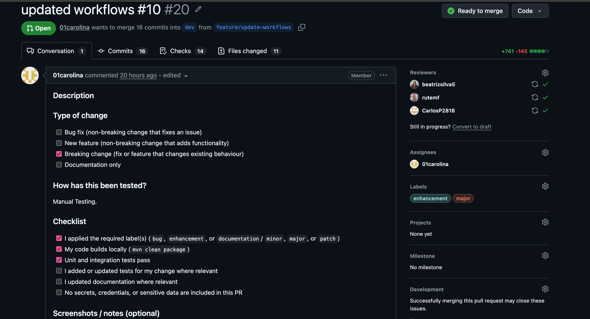
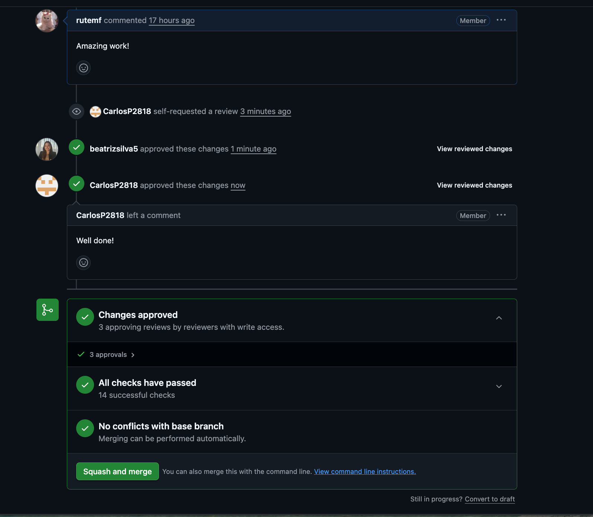

# Phase 2: Sprint 1

---

### Table of Contents

- [Introduction](#introduction)
- [Development](#development)
- [Build and Test](#build-and-test)
- [Pipeline Automation](#pipeline-automation)
- [Test Planning](#test-planning)
- [Conclusion](#conclusion)

---

## Introduction

This document covers the security engineering practices adopted during the development of the **Cantinas de Cinfães** backend — a Spring Boot REST API for managing canteen operations, including user authentication, meal scheduling, and email notifications.

The project follows a **shift-left security** approach, integrating security checks throughout the development lifecycle via three automated GitHub Actions pipelines: one for commits, one for Pull Requests, and one for Releases. Practices include SAST, SCA, DAST, secret scanning, artifact scanning, SBOM generation, and automated testing, all traceable to security requirements defined using the OWASP ASVS.

---

## Development

All the functionalities mentioned in Phase 1 are implemented (some with not all the requirements), constituting the basic operations of create, read, update and delete.

For this project, the following set of development good practices were adopted.

### Audits

In every controller of the BioCantinas App, there are various and relevant audits like the ones exemplified below.

```java
log.info("Authentication attempt for email: {}", dto.getEmail());

LoginResponse loginResponse = authenticationService.login(dto);

if (loginResponse == null) {
    log.warn("Authentication failed for email: {}", dto.getEmail());
    return ResponseEntity.status(401).build();
}

HttpHeaders headers = new HttpHeaders();
headers.add(
    HttpHeaders.AUTHORIZATION,
    loginResponse.getTokenType() + " " + loginResponse.getToken()
);

UserDTO user = loginResponse.getUser();

if (user != null) {
    log.info(
        "User authenticated successfully. User id: {}, email: {}, role: {}",
        user.getId(),
        user.getEmail(),
        user.getRole()
    );
}
```

### Code Reviews

In the repository, it is mandatory that every Pull Request has at least two approvals to be merged, at least a label associated and that all the checks are successful. When the PR is merged, it happens by squash and merge, meaning all the commits in the PR are merged to the other branch as one single commit.




### Repository and Team Rules

- There are 3 branches, `dev`, `e2e` and `main`:
    - `dev` is used for active development where new functionalities are merged.
    - `e2e` receives code from `dev` and is used for end-to-end validation in a more complete environment.
    - `main` represents the code that is fully validated and ready for production.
- Direct commits to `dev`, `e2e` and `main` are not allowed — all changes go through Pull Requests.
- Before merge to dev, branches must follow the naming convention `/feature` for new features or `/bugfix` for bug corrections, and must reference the associated issue. Example: `feature/10-implement-release-workflows`.
- Every commit must have an associated issue, otherwise the push will be rejected.

---

## Build and Test

This section summarises the quality and security practices adopted throughout the development lifecycle, organised by type of practice and indicating when each one runs. Implementation details and pipeline configuration are covered in the [Pipeline Automation](#pipeline-automation) section.

### Inventory of Components

A **Software Bill of Materials (SBOM)** is generated automatically using the CycloneDX Maven Plugin, producing a complete inventory of all Maven dependencies with their versions and licenses. It is generated on every Pull Request and on every Release, and uploaded as an artifact (`sbom` and `final-sbom-<version>` respectively).

### Execution of Test Plans

| Test Type | Plugin | Trigger | Report Artifact |
|---|---|---|---|
| Unit Tests | Maven Surefire | Every commit | `unit-test-reports` |
| Integration Tests | Maven Failsafe | Every Pull Request | `integration-test-reports` |

### Dynamic Analysis

Dynamic Application Security Testing (DAST) is performed on every Release using **OWASP ZAP**. The application is started against a real MySQL 8 database spun up as a service container, and ZAP runs a baseline scan against the live endpoints, testing for OWASP Top 10 vulnerabilities such as XSS, SQL Injection, and insecure headers. Results are uploaded as artifacts and automatically created as a GitHub Issue.

### Configuration Validation

On every commit, the CI pipeline verifies that the required `application.properties` (or `application.yml`) is present, and validates the Docker Compose file syntax using `docker compose config`, catching misconfigurations before they reach further stages.

### Artifact Scanning

The final Docker image is scanned for HIGH and CRITICAL CVEs using **Trivy**, covering both the application layer and the OS base image. This runs on every Pull Request and every Release, with results uploaded to the GitHub Security tab in SARIF format.

### Other Relevant Practices

| Practice | Tool | Trigger |
|---|---|---|
| SAST (lightweight) | Semgrep (`p/java`, `p/owasp-top-ten`, `p/secrets`) | Every commit |
| SAST (deep) | GitHub CodeQL | Every PR and Release |
| SCA | OWASP Dependency Check | Every PR and Release |
| Secret Scanning | Dedicated workflow (`secretDetector.yml`) | Every commit |
| Lint | Checkstyle (Google Java Style Guide) | Every commit |

**Note on IAST**

IAST (Interactive Application Security Testing) combines elements of SAST and DAST by instrumenting the application at runtime during test execution, detecting vulnerabilities with greater precision and fewer false positives than either approach alone. The three most common tools are:

| Tool | Vendor | Notes |
|---|---|---|
| **Contrast Security** | Contrast Security | Agent-based, deep runtime analysis, integrates with CI/CD |
| **Seeker** | Synopsys | Strong compliance reporting, integrates with existing test suites |
| **Hdiv Detection** | Hdiv Security | Lightweight agent, focused on OWASP Top 10 |

All three are commercial products with no free tier suitable for open-source or academic projects. For this reason, IAST was not implemented in this project. SAST (CodeQL + Semgrep) and DAST (OWASP ZAP) were adopted as open-source alternatives that together cover a similar range of vulnerability detection.


---

## Pipeline Automation

Three distinct pipelines were defined applying the concept of shift-left security, with checks appropriate for each stage of the development lifecycle.

### CI Pipeline (commit)

Runs on every push. Designed to be fast and provide immediate feedback.

```yaml
on:
  push:
  workflow_dispatch:
```

#### Job 1: Build

Compiles the project and packages it, skipping tests to keep the pipeline fast. All subsequent jobs depend on this one.

```yaml
build:
  name: Build
  runs-on: ubuntu-latest
  steps:
    - uses: actions/checkout@v4
    - uses: actions/setup-java@v4
      with:
        java-version: 21
        distribution: temurin
    - name: Cache Maven packages
      uses: actions/cache@v4
      with:
        path: ~/.m2
        key: ${{ runner.os }}-m2-${{ hashFiles('**/pom.xml') }}
        restore-keys: ${{ runner.os }}-m2
    - name: Build
      working-directory: cantinas-cinfaes-backend
      run: mvn clean package -DskipTests
```

- `actions/cache@v4`: Caches the Maven local repository to avoid re-downloading dependencies on every run.
- `-DskipTests`: Tests are handled in a dedicated job.

#### Job 2: Lint (Checkstyle)

Enforces the Google Java Style Guide using Checkstyle.

```yaml
lint:
  name: Lint (Checkstyle)
  runs-on: ubuntu-latest
  needs: build
  steps:
    - name: Run Checkstyle
      working-directory: cantinas-cinfaes-backend
      run: mvn checkstyle:check -Dcheckstyle.config.location=google_checks.xml
```

#### Job 3: Unit Tests

Runs unit tests using Maven Surefire and uploads the results as an artifact.

```yaml
unit-tests:
  name: Unit Tests
  runs-on: ubuntu-latest
  needs: build
  steps:
    - name: Run Unit Tests
      working-directory: cantinas-cinfaes-backend
      run: mvn test
      env:
        JWT_TOKEN: ${{ secrets.JWT_TOKEN }}
    - name: Upload Unit Test Reports
      uses: actions/upload-artifact@v4
      with:
        name: unit-test-reports
        path: cantinas-cinfaes-backend/target/surefire-reports
```

#### Job 4: Basic SAST (Semgrep)

Lightweight static analysis covering Java vulnerabilities, OWASP Top 10, and secret detection.

```yaml
sast-basic:
  name: SAST Basic (Semgrep)
  runs-on: ubuntu-latest
  needs: build
  steps:
    - uses: actions/checkout@v4
    - uses: returntocorp/semgrep-action@v1
      with:
        config: >-
          p/java
          p/owasp-top-ten
          p/secrets
```

#### Job 5: Configuration Validation

Verifies that required configuration files exist and that Docker Compose is syntactically valid.

```yaml
config-validation:
  name: Configuration Validation
  runs-on: ubuntu-latest
  needs: build
  steps:
    - name: Validate configuration files
      run: |
        test -f cantinas-cinfaes-backend/src/main/resources/application.properties \
          || test -f cantinas-cinfaes-backend/src/main/resources/application.yml
        echo "Config files present"
    - name: Validate Docker Compose
      run: |
        if [ -f docker-compose.yml ]; then
          docker compose config --quiet && echo "Docker Compose valid"
        fi
```

---

### Security Pipeline (pull request)

Acts as a security gate before code is merged, running deeper checks that would be too slow for every commit.

```yaml
on:
  pull_request:
  workflow_dispatch:
```

#### Job 1: SAST (CodeQL)

Deep bytecode-level static analysis. Results are uploaded to the GitHub Security tab.

```yaml
sast:
  name: SAST (CodeQL)
  runs-on: ubuntu-latest
  permissions:
    actions: read
    contents: read
    security-events: write
  steps:
    - name: Initialize CodeQL
      uses: github/codeql-action/init@v3
      with:
        languages: java
    - name: Build with Maven (for CodeQL)
      working-directory: cantinas-cinfaes-backend
      run: mvn clean package -DskipTests
    - name: Perform CodeQL Analysis
      uses: github/codeql-action/analyze@v3
      with:
        category: "/language:java"
```

- CodeQL requires a full build to analyse the compiled bytecode, unlike Semgrep which analyses source code directly.

#### Job 2: SCA (OWASP Dependency Check)

Scans all Maven dependencies against the NVD for known CVEs.

```yaml
sca:
  name: SCA (OWASP Dependency Check)
  runs-on: ubuntu-latest
  continue-on-error: true
  steps:
    - name: Run OWASP Dependency Check
      working-directory: cantinas-cinfaes-backend
      env:
        NVD_API_KEY: ${{ secrets.NVD_API_KEY }}
      run: >
        mvn org.owasp:dependency-check-maven:check
        -Dnvd.api.key=$NVD_API_KEY
        -Dnvd.api.delay=6000
        -Dnvd.api.maxRetryCount=5
        -DfailBuildOnCVSS=11
    - name: Upload Dependency Check Report
      if: always()
      uses: actions/upload-artifact@v4
      with:
        name: dependency-check-report
        path: cantinas-cinfaes-backend/target/dependency-check-report.html
```

- `continue-on-error: true`: The pipeline continues even if vulnerabilities are found, ensuring the full report is always generated.
- `-DfailBuildOnCVSS=11`: Set above the maximum CVSS score so the build never hard-fails — findings are reviewed manually from the uploaded report.

#### Job 3: SBOM (CycloneDX)

Generates a Software Bill of Materials for the PR, providing a component inventory.

```yaml
sbom:
  name: SBOM (CycloneDX)
  runs-on: ubuntu-latest
  needs: sca
  steps:
    - name: Generate SBOM
      working-directory: cantinas-cinfaes-backend
      run: mvn org.cyclonedx:cyclonedx-maven-plugin:makeAggregateBom
    - name: Upload SBOM
      uses: actions/upload-artifact@v4
      with:
        name: sbom
        path: cantinas-cinfaes-backend/target/bom.json
```

#### Job 4: Integration Tests

Runs integration tests using Maven Failsafe after SAST completes.

```yaml
integration-tests:
  name: Integration Tests
  runs-on: ubuntu-latest
  needs: sast
  steps:
    - name: Run Integration Tests
      working-directory: cantinas-cinfaes-backend
      run: mvn verify
      env:
        JWT_TOKEN: ${{ secrets.JWT_TOKEN }}
    - name: Upload Integration Test Reports
      uses: actions/upload-artifact@v4
      with:
        name: integration-test-reports
        path: cantinas-cinfaes-backend/target/failsafe-reports
```

#### Job 5: Container Scanning (Trivy)

Builds the Docker image and scans it for HIGH and CRITICAL vulnerabilities.

```yaml
container-scanning:
  name: Container Scanning (Trivy)
  runs-on: ubuntu-latest
  permissions:
    security-events: write
  steps:
    - name: Build JAR first
      working-directory: cantinas-cinfaes-backend
      run: mvn clean package -DskipTests
    - name: Build Docker image
      run: docker build -t myapp:${{ github.sha }} cantinas-cinfaes-backend/
    - name: Trivy scan
      uses: aquasecurity/trivy-action@master
      with:
        image-ref: myapp:${{ github.sha }}
        format: sarif
        output: trivy-results.sarif
        severity: HIGH,CRITICAL
    - uses: github/codeql-action/upload-sarif@v3
      with:
        sarif_file: trivy-results.sarif
```

- Results are uploaded in SARIF format, integrating natively with the GitHub Security tab as code scanning alerts.

---

### DAST Pipeline (release)

The most comprehensive pipeline, triggered when a GitHub Release is published. Runs a full suite of security scans against the released code and artifact.

```yaml
on:
  release:
    types: [published]
```

#### Job 1: Full Security Scan (CodeQL + Semgrep)

Combines CodeQL and Semgrep for maximum SAST coverage at release time.

```yaml
full-security-scan:
  name: Full Security Scan (CodeQL + Semgrep)
  runs-on: ubuntu-latest
  permissions:
    actions: read
    contents: read
    security-events: write
  steps:
    - name: Initialize CodeQL
      uses: github/codeql-action/init@v3
      with:
        languages: java
    - name: Build with Maven
      working-directory: cantinas-cinfaes-backend
      run: mvn clean package -DskipTests
    - name: Perform CodeQL Analysis
      uses: github/codeql-action/analyze@v3
    - name: Semgrep Full Scan
      uses: returntocorp/semgrep-action@v1
      with:
        config: >-
          p/java
          p/owasp-top-ten
          p/secrets
```

#### Job 2: Full CVE Scan (OWASP DC + Trivy FS)

Full SCA with OWASP Dependency Check plus a Trivy filesystem scan covering the OS layer and configuration files.

```yaml
full-cve-scan:
  name: Full CVE Scan (OWASP DC + Trivy FS)
  runs-on: ubuntu-latest
  needs: full-security-scan
  steps:
    - name: OWASP Dependency Check
      working-directory: cantinas-cinfaes-backend
      env:
        NVD_API_KEY: ${{ secrets.NVD_API_KEY }}
      run: >
        mvn org.owasp:dependency-check-maven:check
        -Dnvd.api.key=${{ secrets.NVD_API_KEY }}
        -Dnvd.api.delay=2000
        -Dnvd.api.maxRetryCount=10
    - name: Trivy Filesystem Scan
      uses: aquasecurity/trivy-action@master
      with:
        scan-type: fs
        scan-ref: .
        severity: HIGH,CRITICAL
    - name: Upload CVE Report
      if: always()
      uses: actions/upload-artifact@v4
      with:
        name: full-cve-report
        path: cantinas-cinfaes-backend/target/dependency-check-report.html
```

- `scan-type: fs`: Scans the entire filesystem, going beyond declared dependencies to catch vulnerabilities in the OS layer and scripts.

#### Job 3: Artifact Scanning (Trivy)

Scans the final Docker image — the exact artifact deployed to production — for HIGH and CRITICAL CVEs.

```yaml
artifact-scanning:
  name: Artifact Scanning (Trivy)
  runs-on: ubuntu-latest
  needs: full-cve-scan
  permissions:
    security-events: write
  steps:
    - name: Build JAR
      working-directory: cantinas-cinfaes-backend
      run: mvn clean package -DskipTests
    - name: Build Docker image
      run: docker build -t myapp:${{ github.sha }} cantinas-cinfaes-backend/
    - name: Trivy image scan
      uses: aquasecurity/trivy-action@master
      with:
        image-ref: myapp:${{ github.sha }}
        format: sarif
        output: trivy-results.sarif
        severity: HIGH,CRITICAL
    - uses: github/codeql-action/upload-sarif@v3
      with:
        sarif_file: trivy-results.sarif
```

#### Job 4: Dynamic Analysis (OWASP ZAP)

Starts the application against a real MySQL database and runs a ZAP baseline scan against the live endpoints.

```yaml
dast:
  name: Dynamic Analysis (OWASP ZAP)
  runs-on: ubuntu-latest
  needs: full-cve-scan
  services:
    mysql:
      image: mysql:8
      env:
        MYSQL_ROOT_PASSWORD: testpassword
        MYSQL_DATABASE: cantinasDB
      ports:
        - 3306:3306
      options: --health-cmd="mysqladmin ping" --health-interval=10s --health-timeout=5s --health-retries=5
  steps:
    - name: Start Spring Boot application
      working-directory: cantinas-cinfaes-backend
      run: java -jar target/*.jar &
      env:
        SPRING_PROFILES_ACTIVE: test
        SPRING_DATASOURCE_URL: jdbc:mysql://localhost:3306/cantinasDB
        SPRING_DATASOURCE_USERNAME: root
        SPRING_DATASOURCE_PASSWORD: testpassword
    - name: Wait for application to be ready
      run: |
        for i in {1..24}; do
          if curl -sf http://localhost:8080/actuator/health; then
            echo "Application is up!"
            exit 0
          fi
          sleep 5
        done
        exit 1
    - name: OWASP ZAP Baseline Scan
      uses: zaproxy/action-baseline@v0.14.0
      with:
        target: 'http://localhost:8080'
        fail_action: false
        issue_title: 'ZAP Baseline Scan Report'
```

- The pipeline waits up to 120 seconds for the application to become healthy via `/actuator/health` before ZAP begins.
- `fail_action: false`: Findings are reported without failing the pipeline, and are automatically created as a GitHub Issue.

#### Job 5: Final SBOM (CycloneDX)

Generates the official component inventory for the release, tagged with the version number.

```yaml
final-sbom:
  name: Final SBOM (CycloneDX)
  runs-on: ubuntu-latest
  needs: full-cve-scan
  steps:
    - name: Generate Final SBOM
      working-directory: cantinas-cinfaes-backend
      run: mvn org.cyclonedx:cyclonedx-maven-plugin:makeAggregateBom
    - name: Upload Final SBOM
      uses: actions/upload-artifact@v4
      with:
        name: final-sbom-${{ github.ref_name }}
        path: cantinas-cinfaes-backend/target/bom.json
```

- Tagged with `github.ref_name` (e.g. `final-sbom-v1.0.0`), making it easy to correlate with a specific release.

#### Job 6: Release Publication

Creates the GitHub Release and publishes the JAR as a release asset. This job only runs after all security scans (`artifact-scanning`, `dast`, and `final-sbom`) have completed successfully, ensuring the release is only published once the artifact has passed all checks.

```yaml
release:
  name: Release Publication
  runs-on: ubuntu-latest
  needs: [artifact-scanning, dast, final-sbom]
  permissions:
    contents: write
  steps:
    - name: Build project
      working-directory: cantinas-cinfaes-backend
      run: mvn clean package -DskipTests
    - name: Create GitHub Release
      uses: softprops/action-gh-release@v2
      with:
        files: cantinas-cinfaes-backend/target/*.jar
      env:
        GITHUB_TOKEN: ${{ secrets.GITHUB_TOKEN }}
```

- `needs: [artifact-scanning, dast, final-sbom]`: The release is only published after all three parallel scanning jobs finish, making it the final gate of the pipeline.
- `softprops/action-gh-release@v2`: Creates the GitHub Release and attaches the built JAR as a downloadable release asset.

### Release Flow

The DAST pipeline is triggered by the `release: published` GitHub event, meaning it does not run on a tag push alone. The full flow to publish a release is:

**1. Create and push a tag locally:**
```bash
git tag v1.0.0
git push origin v1.0.0
```

**2. Create the GitHub Release manually:**

Go to **Releases → Draft a new release**, select the tag `v1.0.0`, and publish it.

**3. The pipeline triggers automatically:**

The `release: published` event fires and the `dast.yml` pipeline starts, running all security scans in sequence.

**4. The JAR is attached to the release:**

Once all scans complete, the final `release` job runs and attaches the built JAR to the GitHub Release as a downloadable asset.

```
git tag v1.0.0 → git push origin v1.0.0
  └─► GitHub: create Release manually with that tag
        └─► dast.yml triggers (release: published)
              └─► full-security-scan
                    └─► full-cve-scan
                          ├─► artifact-scanning
                          ├─► dast (ZAP)
                          └─► final-sbom
                                └─► release (attaches JAR to GitHub Release)
```

This approach ensures the JAR is only attached to the release **after all security scans have passed**, preventing the publication of an artifact that has not been fully validated.

---

## Test Planning

# Security Testing Methodology and Threat Modelling - BioCantinas

This document establishes the security testing methodology, threat modelling review process, and abuse cases associated with the BioCantinas system flows. The approach is built upon the **OWASP ASVS 5.0 (Application Security Verification Standard)** and the **STRIDE** model, ensuring full traceability between identified threats, mitigations, and their respective validation criteria (conceptual tests).

---

## 1. Security Testing Methodology and Review Process

To validate the proposed mitigations without the immediate need for exhaustive code-specific test scripts (aligning with a security architecture and design perspective), a framework based on three pillars is adopted:

1. **Threat Modelling Review Process:** Threat modelling is a continuous process. Whenever a data flow or system component within BioCantinas is modified, the STRIDE matrix is reviewed to ensure that new attack vectors are anticipated and mitigated before implementation.
2. **Abuse Cases Definition:** The testing plan focuses on the system's behavior under attack (the unhappy path), describing the actions of a malicious actor attempting to break the business logic.
3. **Security Traceability:** Ensures a direct link between the Threat (STRIDE), the Mitigation (ASVS), and the Conceptual Test that validates whether the mitigation is working effectively.

---

## 2. Security Testing Plan by Flow

### 2.1. Authentication

| Threat | Targeted Element | STRIDE Category | Description | Mitigation (ASVS 5.0) | Abuse Case | Conceptual Verification / Test |
| :--- | :---: | :---: | :--- | :--- | :--- | :--- |
| **Auth Bypass via SQL Injection** | Database Server | Tampering | Malicious input in login fields used to bypass the password check in the MySQL DB. | **V1.2.3**: Use parameterized queries and input sanitization for all database interactions. | An attacker inserts SQLi payloads (e.g., `' OR '1'='1`) into the login fields to bypass authentication. | **Test:** Submit SQL injection strings to the login endpoint. Validate that the API rejects the request with `401 Unauthorized` and does not expose database errors. |
| **SMTP/IMAP Injection via unsanitized input** | Mail System Interface | Tampering | User input (e.g., email fields, subject, headers) is not properly sanitized before being used in mail protocols, allowing attackers to inject additional commands or headers (e.g., adding recipients, altering message content). | **V1.3.11**: Sanitize and validate all user inputs used in email construction; strip CRLF characters; use safe mail libraries; enforce strict input validation and encoding; avoid direct concatenation into mail headers. | An attacker injects line breaks (`\r\n`) and headers like `Bcc:` into forms to use the mail server for sending SPAM. | **Test:** Send HTTP requests containing CRLF sequences in email text fields. Verify that the system sanitizes or blocks the malicious characters. |
| **Brute Force/Credential Stuffing** | Login Endpoint | Spoofing | Attackers use automated scripts to test leaked passwords against the BioCantinas API. | **V6.1.1**: Implement rate limiting, anti-automation, and account lockout after 3 failed attempts. | An attacker runs an automated script with hundreds of passwords against a single legitimate user account. | **Test:** Trigger multiple rapid, sequential login requests. Validate that the API blocks the IP/Account with `429 Too Many Requests` after the 3rd failed attempt. |
| **Weak passwords due to use of context-specific words** | Authentication System | Spoofing | Users create passwords using predictable, organization-related terms (e.g., company name, project names, roles), making them easier to guess or brute-force by attackers with knowledge of the organization. | **V6.1.2**: Maintain and enforce a deny-list of context-specific words (organization name, products, internal terms); integrate with password validation mechanisms; combine with strong password policies (length, complexity, banned passwords list); periodically update the list and document it clearly. | An attacker tries to guess credentials using easy words associated with the company's context (e.g., `BioCantinas123`). | **Test:** Attempt to create or change a password to a term included in the deny-list. The system must reject the submission and display a policy error. |
| **Account compromise via weak knowledge-based authentication** | Authentication System | Spoofing | The application uses password hints or security questions (e.g., “mother’s maiden name”), which are often easily guessable or obtainable via social engineering or public information, allowing attackers to bypass authentication. | **V6.4.1**: Eliminate password hints and security questions; replace with stronger recovery mechanisms (e.g., MFA, email-based reset with secure tokens, identity verification); follow modern authentication best practices. | An attacker gathers public data from the user's social media to answer security questions and steal account access. | **Test:** Architecturally validate the complete absence of "security question" fields and test the secure token-based reset flow via email. |
| **Account lockout or forced insecure recovery due to expired authentication factors** | Authentication System | Denial of Service | Users are not notified in advance about expiring credentials (e.g., passwords, tokens, certificates), leading to sudden expiration, potential service disruption, or reliance on less secure recovery processes. | **V6.4.5**: Send advance notifications before expiration (multiple reminders); implement automated renewal alerts; allow secure self-service renewal; define appropriate validity periods and grace windows. | A user's account expires abruptly, forcing them to use slow or insecure support channels to regain access. | **Test:** Verify the automatic transmission of expiration warnings in the system and test if the self-service flow allows early renewal. |
| **Unauthorized access due to admin-controlled password reset** | Authentication System | Elevation of Privilege | Administrative users can reset and set a user’s password directly, allowing them to know the password and potentially access the account without the user’s consent. | **V6.4.6**: Ensure admins can only trigger reset workflows (e.g., send reset link/token) without setting the password; enforce user-controlled password creation; log and audit all reset actions; apply least privilege principles. | A malicious Admin directly sets a known password for another user's account to log in covertly. | **Test:** Access the admin panel and validate that the Admin can only click "Send reset link", with no input field available to type a password. |
| **Unauthorized access due to lack of session inactivity timeout** | Session Management | Elevation of Privilege | The application does not enforce an inactivity timeout, allowing sessions to remain active indefinitely. An attacker with access to an unattended device or stolen session can continue to use the session without re-authentication. | **V6.7.3** Implement inactivity timeouts based on risk (e.g., shorter for sensitive operations); enforce automatic session expiration; require re-authentication after timeout; document timeout values and rationale; consider absolute session lifetime limits. | An attacker uses a computer left unattended with an active BioCantinas session at a counter for several hours. | **Test:** Leave a session token inactive beyond the specified timeout limit. Submit a new API request using that token and validate that it returns `401 Unauthorized`. |
| **Session Hijacking** | Browser Storage | Spoofing | An attacker steals an active session token from a shared computer's LocalStorage. | **V7.4.1**: Implement absolute session timeouts (20 min) and clear tokens upon logout. | An attacker inspects and copies the token from LocalStorage after a legitimate user leaves the browser. | **Test:** Click "Logout" and verify that the old token is immediately invalidated on the server, rejecting any subsequent HTTP requests. |
| **Privilege Escalation** | Admin API | Elevation of Privilege | A Supplier attempts to call the `ApproveSupplier` endpoint directly without Admin rights. | **V8.1.1**: Implement strict server-side Role-Based Access Control (RBAC). | A user with `Supplier` privileges sends a direct HTTP request to the Admin-only approval route. | **Test:** Authenticate as a `Supplier`, intercept the traffic, and submit a request to `/api/admin/ApproveSupplier`. The server must return `403 Forbidden`. |
| **JWT Payload Tampering** | Access Token | Tampering | A user modifies the claims in their JWT (e.g., changing role: `Dietitian` to `Admin`). | **V9.1.1**: Always validate the digital signature of the JWT before accepting its contents. | A user modifies the `role` claim in their token locally but lacks the secret key to correctly re-sign the token. | **Test:** Alter the `role` claim inside the JWT and send the modified request. The server must detect the invalid signature and reject the transaction. |
| **Credential Sniffing** | Network Traffic | Information Disclosure | Plaintext credentials (email/password) intercepted during transmission over the Internet. | **V12.1.1**: Enforce TLS 1.2/1.3 for all communications between Frontend and Backend. | An attacker sniffs network packets on a public Wi-Fi network to read passwords traveling without encryption. | **Test:** Attempt to perform a request using unencrypted HTTP (port 80). The server must reject the connection or force a redirect to HTTPS. |
| **Insecure Password Creation** | User Profile | Elevation of Privilege | Users choose easily guessable passwords, making accounts vulnerable to takeover. | **V6.2.1**: Enforce a 10-character minimum with uppercase, numbers, and special characters. | A user attempts to register an account by setting `12345` or `qwerty` as their password. | **Test:** Attempt to submit a weak or short password on the registration/profile form. The system must block creation and mandate the minimum criteria. |
| **Action Repudiation** | Audit Logs | Repudiation | An admin denies rejecting a valid supplier, and there is no trace of the specific action | **V16.2.1**: Ensure every security-relevant event includes metadata (Who, What, When, Where). | An admin rejects a legitimate supplier and denies doing so, leveraging the lack of detailed system audit logs. | **Test:** Perform a rejection action and validate in the database/log file that the event recorded the Admin's ID, timestamp, IP, and exact action. |

### 2.2. Supplier Approval

| Threat | Targeted Element | STRIDE Category | Description | Mitigation (ASVS 5.0) | Abuse Case | Conceptual Verification / Test |
| :--- | :---: | :---: | :--- | :--- | :--- | :--- |
| **Registration Flooding (DoS)** | BioCantinas API | Denial of Service | An attacker submits thousands of fake applications or oversized files to exhaust CPU, Memory, or Database storage. | **V2.4.1**: Implement rate limiting and anti-automation (CAPTCHA) on the public registration endpoint. | An attacker uses a script to submit thousands of registration forms per second, trying to crash the server. | **Test:** Simulate a registration flood attack with concurrent requests. Validate that the rate-limiting mechanism blocks the excess traffic. |
| **Malicious File Upload** | BioCantinas API | Tampering | A supplier uploads a PDF containing a malicious script (XSS) or a virus. | **V5.2.2**: Validate magic bytes for PDF format and enforce a 5MB size limit, restrict extensions to **.PDF** | An attacker disguises an executable virus by changing its extension (e.g., from `script.exe` to `document.pdf`) and uploads it. | **Test:** Upload an executable file renamed to `.pdf` and a genuine PDF exceeding 5MB. The system must reject both cases. |
| **PDF Path Traversal** | Database | Tampering | An attacker uses a malicious filename during upload to overwrite critical system files. | **V5.3.2**: Use internally generated filenames (e.g., GUIDs) for storage instead of the original user-submitted name. | An attacker submits a document named `../../../../etc/passwd` to overwrite operating system files. | **Test:** Upload a file containing path traversal characters (`../`) in its name. Validate on the server that the file was saved using a random UUID instead. |
| **Unauthorized Approval Bypass** | Update Approval Status | Elevation of Privilege | An attacker or unauthorized user calls the approval endpoint directly to approve their own application without Admin review. | **V8.1.1**: Enforce strict server-side Role-Based Access Control (RBAC). Only the Administrator role can modify SupplierStatus. | A user attempts to send a status update request to `/api/supplier/status` to self-approve their application. | **Test:** Attempt to submit a status modification request authenticated as a non-admin account. The server must respond with `403 Forbidden`. |
| **Supplier Data Interception** | Internet Boundary | Information Disclosure | Sensitive data (NIF, Address, BIO Certificate) is intercepted in transit between the Supplier and the API. | **V12.2.1**: Mandate the use of TLS 1.2/1.3 (HTTPS) for all external communication. | An attacker intercepts network traffic to steal biological certificates and fiscal data submitted by suppliers. | **Test:** Inspect server response headers and verify that policies like HSTS force encrypted communication via TLS and prevent downgraded connections. |
| **Decision Email Tampering** | Email System Boundary | Tampering | An attacker intercepts the "Approved" email and replaces the credential setup link with a phishing URL. | **V12.3.1**: Secure communication with the Notification Service; REQ4.3: Use short-lived (24h) and single-use setup tokens. | An attacker intercepts or attempts to reuse an old credential configuration link sent via email to gain access. | **Test:** Attempt to use the same setup link twice or after 24 hours have passed. The system must treat the token as expired/invalid. |
| **Denial of Approval Action** | Administrator Action | Repudiation | An Administrator approves a supplier without a proper interview (violating REQ4.2) and later denies the action. | **V16.2.1**: Log all status changes with metadata: Actor ID, Target Supplier ID, Timestamp, and previous/new state. | An administrator improperly approves a partner without an interview and deletes or denies the action to avoid accountability. | **Test:** Perform an approval action and verify that the generated log entry contains the previous state, new state, and the ID of the responsible Admin. |

### 2.3. Supplier Management

| Threat | Targeted Element | STRIDE Category | Description | Mitigation (ASVS 5.0) | Abuse Case | Conceptual Verification / Test |
| :--- | :---: | :---: | :--- | :--- | :--- | :--- |
| **Mass Data Exfiltration** | Database Server | Information Disclosure | Attackers use automated scripts to perform excessive API calls to dump the entire supplier database. | **V2.4.1**: Implement anti-automation and rate-limiting controls to prevent mass data exfiltration and ensure requests follow realistic human timing. | An attacker scrapes the API by continuously and rapidly querying all supplier profiles to dump the full database. | **Test:** Run an automated script making hundreds of read requests to the API. Validate that the system throttles the requests and limits the per-page volume. |
| **CSRF on Management Actions** | BioCantinas API | Tampering | An admin is tricked into clicking a link that triggers a hidden request to deactivate a supplier account. | **V4.1.4**: Ensure state-changing operations (Edit/Delete) require modern anti-CSRF protections or custom headers. | An authenticated administrator visits a malicious website that silently triggers an invisible request to delete a supplier in BioCantinas. | **Test:** Replicate an HTTP deletion request while omitting anti-CSRF tokens or custom application headers. The API must reject the request. |
| **Insecure Direct Object Reference (IDOR)** | BioCantinas API | Elevation of Privilege | An attacker (or a non-admin user) modifies the `supplierID` in the API request to edit a supplier they shouldn't access. | **V8.1.1**: Verify that authorization rules restrict data-specific access based on permissions. | Supplier A changes the ID in the HTTP request body from `101` to `102` to modify Supplier B's profile data. | **Test:** Authenticate as Supplier A and submit data changes targeting Supplier B's ID. The server must deny access with a `403` status. |
| **Unauthorized Account Deactivation** | Edit/Delete Process | Elevation of Privilege | A user with lower privileges calls the `DeleteSupplier` endpoint (REQ7.2) without being an Administrator. | **V8.2.2**: Ensure all management endpoints verify the `Administrator` role on every request. | A regular user attempts to directly invoke the `/api/supplier/delete` endpoint to deactivate an account. | **Test:** Send a deletion request authenticated with a regular user token (lacking privileges). Validate that the server responds with `403 Forbidden`. |
| **Race Condition** | Database Server | Tampering | Two admins edit the same supplier simultaneously, leading to data corruption or inconsistent states. | **V15.4.2**: Implement atomic operations or optimistic locking to prevent data corruption during concurrent edits. | Two administrators edit the exact same supplier record at the exact same moment, causing data corruption or inconsistent states. | **Test:** Send two concurrent update requests for the same record with conflicting data. The system must process one and reject the other. |
| **Administrative Repudiation** | Database Server | Repudiation | An admin deletes or changes a supplier's contract terms and later denies it; there is no record of the previous value. | **V16.2.1**: Log metadata (who, what, when) for every administrative "Write" operation on supplier data. | An admin changes a partner's contract terms and denies doing so, relying on the anonymity of unlogged modifications. | **Test:** Complete a contract modification and check the audit logs. Ensure that the old value, new value, and author's identity are correctly preserved. |
| **Sensitive Data Leakage in Logs** | System Logs | Information Disclosure | The API logs the full payload of a supplier update, accidentally including the supplier's private bio-certificate details or passwords. | **V16.2.5**: Ensure sensitive data is scrubbed or masked before being written to security logs. | An attacker gains access to log files and finds plaintext passwords or industrial secrets recorded due to over-verbose logging. | **Test:** Force a processing error involving confidential fields. Review the generated log entry and ensure that sensitive data is masked with `***`. |

### 2.4. Meal Planning Management

| Threat | Targeted Element | STRIDE Category | Description | Mitigation (ASVS 5.0) | Abuse Case | Conceptual Verification / Test |
| :--- | :---: | :---: | :--- | :--- | :--- | :--- |
| **Menu Tampering** | API BioCantinas | Tampering | An attacker modifies dish of a menu. | **V1.2.3**: Validate and sanitize all inputs; **V8.1.1**: Restrict menu editing only to the `Dietitian` role. | A supplier attempts to modify weekly menu dishes to force the consumption of their own stock. | **Test:** Send a menu update request using credentials that do not belong to the `Dietitian` role. The server must reject the operation. |
| **Impersonation Publishing** | Publishing Process | Spoofing | An unauthorized user poses as a Dietitian to publish a fake or harmful meal plan. | **V9.1.1**: Validate JWT signature and `role` claim on every publishing request. | An attacker forges an HTTP header pretending to be a dietitian to approve and publish false or harmful menus. | **Test:** Submit a meal plan with a modified JWT token or one whose role claim is invalid. The system must validate the token signature and trigger an error. |
| **Specific Diet Data Leak** | Database Server | Information Disclosure | Unauthorized access to meal plans containing notes on allergies. | **V14.1.1**: Classify allergy data as sensitive and apply encryption at rest. | An attacker tries to query database tables or extract reports to expose allergy and sensitive medical notes belonging to other users. | **Test:** Attempt to download meal planning data via the API using a profile without clinical privileges. Ensure that health note fields are omitted or blank. |
| **DoS via Complex Plans** | BioCantinas System | Denial of Service | Mass submission of overly complex meal plans to exhaust the nutritional calculation processor. | **V13.1.2**: Implement timeouts and resource limits for heavy calculation processes on the API. | An attacker sends giant menus containing millions of nutritional variables to tie up the processor and freeze the application. | **Test:** Submit a deliberately heavy or complex payload to the calculation engine. Validate that the API terminates the process via a controlled timeout. |
| **Action Repudiation** | Audit Logs | Repudiation | A dietitian publishes a plan with severe errors and later denies being the author of the submission. | **V16.2.1**: Log detailed metadata (who, what, when) for every published or edited menu. | A dietitian mistakenly publishes a menu containing dangerous allergens and denies being the person who uploaded the file. | **Test:** Publish a menu and inspect the audit log entry, verifying the explicit presence of the responsible dietitian's ID. |

### 2.5. Order Product
# Phase 2: Sprint 1

---

### Table of Contents

- [Introduction](#introduction)
- [Development](#development)
- [Build and Test](#build-and-test)
- [Pipeline Automation](#pipeline-automation)
- [Test Planning](#test-planning)
- [Conclusion](#conclusion)

---

## Introduction

This document covers the security engineering practices adopted during the development of the **Cantinas de Cinfães** backend — a Spring Boot REST API for managing canteen operations, including user authentication, meal scheduling, and email notifications.

The project follows a **shift-left security** approach, integrating security checks throughout the development lifecycle via three automated GitHub Actions pipelines: one for commits, one for Pull Requests, and one for Releases. Practices include SAST, SCA, DAST, secret scanning, artifact scanning, SBOM generation, and automated testing, all traceable to security requirements defined using the OWASP ASVS.

---

## Development

All the functionalities mentioned in Phase 1 are implemented (some with not all the requirements), constituting the basic operations of create, read, update and delete.

For this project, the following set of development good practices were adopted.

### Audits

In every controller of the BioCantinas App, there are various and relevant audits like the ones exemplified below.

```java
log.info("Authentication attempt for email: {}", dto.getEmail());

LoginResponse loginResponse = authenticationService.login(dto);

if (loginResponse == null) {
    log.warn("Authentication failed for email: {}", dto.getEmail());
    return ResponseEntity.status(401).build();
}

HttpHeaders headers = new HttpHeaders();
headers.add(
    HttpHeaders.AUTHORIZATION,
    loginResponse.getTokenType() + " " + loginResponse.getToken()
);

UserDTO user = loginResponse.getUser();

if (user != null) {
    log.info(
        "User authenticated successfully. User id: {}, email: {}, role: {}",
        user.getId(),
        user.getEmail(),
        user.getRole()
    );
}
```

### Code Reviews

In the repository, it is mandatory that every Pull Request has at least two approvals to be merged, at least a label associated and that all the checks are successful. When the PR is merged, it happens by squash and merge, meaning all the commits in the PR are merged to the other branch as one single commit.


### Repository and Team Rules

- There are 3 branches, `dev`, `e2e` and `main`:
    - `dev` is used for active development where new functionalities are merged.
    - `e2e` receives code from `dev` and is used for end-to-end validation in a more complete environment.
    - `main` represents the code that is fully validated and ready for production.
- Direct commits to `dev`, `e2e` and `main` are not allowed — all changes go through Pull Requests.
- Before merge to dev, branches must follow the naming convention `/feature` for new features or `/bugfix` for bug corrections, and must reference the associated issue. Example: `feature/10-implement-release-workflows`.
- Every commit must have an associated issue, otherwise the push will be rejected.

---

## Build and Test

This section summarises the quality and security practices adopted throughout the development lifecycle, organised by type of practice and indicating when each one runs. Implementation details and pipeline configuration are covered in the [Pipeline Automation](#pipeline-automation) section.

### Inventory of Components

A **Software Bill of Materials (SBOM)** is generated automatically using the CycloneDX Maven Plugin, producing a complete inventory of all Maven dependencies with their versions and licenses. It is generated on every Pull Request and on every Release, and uploaded as an artifact (`sbom` and `final-sbom-<version>` respectively).

### Execution of Test Plans

| Test Type | Plugin | Trigger | Report Artifact |
|---|---|---|---|
| Unit Tests | Maven Surefire | Every commit | `unit-test-reports` |
| Integration Tests | Maven Failsafe | Every Pull Request | `integration-test-reports` |

### Dynamic Analysis

Dynamic Application Security Testing (DAST) is performed on every Release using **OWASP ZAP**. The application is started against a real MySQL 8 database spun up as a service container, and ZAP runs a baseline scan against the live endpoints, testing for OWASP Top 10 vulnerabilities such as XSS, SQL Injection, and insecure headers. Results are uploaded as artifacts and automatically created as a GitHub Issue.

### Configuration Validation

On every commit, the CI pipeline verifies that the required `application.properties` (or `application.yml`) is present, and validates the Docker Compose file syntax using `docker compose config`, catching misconfigurations before they reach further stages.

### Artifact Scanning

The final Docker image is scanned for HIGH and CRITICAL CVEs using **Trivy**, covering both the application layer and the OS base image. This runs on every Pull Request and every Release, with results uploaded to the GitHub Security tab in SARIF format.

### Other Relevant Practices

| Practice | Tool | Trigger |
|---|---|---|
| SAST (lightweight) | Semgrep (`p/java`, `p/owasp-top-ten`, `p/secrets`) | Every commit |
| SAST (deep) | GitHub CodeQL | Every PR and Release |
| SCA | OWASP Dependency Check | Every PR and Release |
| Secret Scanning | Dedicated workflow (`secretDetector.yml`) | Every commit |
| Lint | Checkstyle (Google Java Style Guide) | Every commit |

**Note on IAST**

IAST (Interactive Application Security Testing) combines elements of SAST and DAST by instrumenting the application at runtime during test execution, detecting vulnerabilities with greater precision and fewer false positives than either approach alone. The three most common tools are:

| Tool | Vendor | Notes |
|---|---|---|
| **Contrast Security** | Contrast Security | Agent-based, deep runtime analysis, integrates with CI/CD |
| **Seeker** | Synopsys | Strong compliance reporting, integrates with existing test suites |
| **Hdiv Detection** | Hdiv Security | Lightweight agent, focused on OWASP Top 10 |

All three are commercial products with no free tier suitable for open-source or academic projects. For this reason, IAST was not implemented in this project. SAST (CodeQL + Semgrep) and DAST (OWASP ZAP) were adopted as open-source alternatives that together cover a similar range of vulnerability detection.


---

## Pipeline Automation

Three distinct pipelines were defined applying the concept of shift-left security, with checks appropriate for each stage of the development lifecycle.

### CI Pipeline (commit)

Runs on every push. Designed to be fast and provide immediate feedback.

```yaml
on:
  push:
  workflow_dispatch:
```

#### Job 1: Build

Compiles the project and packages it, skipping tests to keep the pipeline fast. All subsequent jobs depend on this one.

```yaml
build:
  name: Build
  runs-on: ubuntu-latest
  steps:
    - uses: actions/checkout@v4
    - uses: actions/setup-java@v4
      with:
        java-version: 21
        distribution: temurin
    - name: Cache Maven packages
      uses: actions/cache@v4
      with:
        path: ~/.m2
        key: ${{ runner.os }}-m2-${{ hashFiles('**/pom.xml') }}
        restore-keys: ${{ runner.os }}-m2
    - name: Build
      working-directory: cantinas-cinfaes-backend
      run: mvn clean package -DskipTests
```

- `actions/cache@v4`: Caches the Maven local repository to avoid re-downloading dependencies on every run.
- `-DskipTests`: Tests are handled in a dedicated job.

#### Job 2: Lint (Checkstyle)

Enforces the Google Java Style Guide using Checkstyle.

```yaml
lint:
  name: Lint (Checkstyle)
  runs-on: ubuntu-latest
  needs: build
  steps:
    - name: Run Checkstyle
      working-directory: cantinas-cinfaes-backend
      run: mvn checkstyle:check -Dcheckstyle.config.location=google_checks.xml
```

#### Job 3: Unit Tests

Runs unit tests using Maven Surefire and uploads the results as an artifact.

```yaml
unit-tests:
  name: Unit Tests
  runs-on: ubuntu-latest
  needs: build
  steps:
    - name: Run Unit Tests
      working-directory: cantinas-cinfaes-backend
      run: mvn test
      env:
        JWT_TOKEN: ${{ secrets.JWT_TOKEN }}
    - name: Upload Unit Test Reports
      uses: actions/upload-artifact@v4
      with:
        name: unit-test-reports
        path: cantinas-cinfaes-backend/target/surefire-reports
```

#### Job 4: Basic SAST (Semgrep)

Lightweight static analysis covering Java vulnerabilities, OWASP Top 10, and secret detection.

```yaml
sast-basic:
  name: SAST Basic (Semgrep)
  runs-on: ubuntu-latest
  needs: build
  steps:
    - uses: actions/checkout@v4
    - uses: returntocorp/semgrep-action@v1
      with:
        config: >-
          p/java
          p/owasp-top-ten
          p/secrets
```

#### Job 5: Configuration Validation

Verifies that required configuration files exist and that Docker Compose is syntactically valid.

```yaml
config-validation:
  name: Configuration Validation
  runs-on: ubuntu-latest
  needs: build
  steps:
    - name: Validate configuration files
      run: |
        test -f cantinas-cinfaes-backend/src/main/resources/application.properties \
          || test -f cantinas-cinfaes-backend/src/main/resources/application.yml
        echo "Config files present"
    - name: Validate Docker Compose
      run: |
        if [ -f docker-compose.yml ]; then
          docker compose config --quiet && echo "Docker Compose valid"
        fi
```

---

### Security Pipeline (pull request)

Acts as a security gate before code is merged, running deeper checks that would be too slow for every commit.

```yaml
on:
  pull_request:
  workflow_dispatch:
```

#### Job 1: SAST (CodeQL)

Deep bytecode-level static analysis. Results are uploaded to the GitHub Security tab.

```yaml
sast:
  name: SAST (CodeQL)
  runs-on: ubuntu-latest
  permissions:
    actions: read
    contents: read
    security-events: write
  steps:
    - name: Initialize CodeQL
      uses: github/codeql-action/init@v3
      with:
        languages: java
    - name: Build with Maven (for CodeQL)
      working-directory: cantinas-cinfaes-backend
      run: mvn clean package -DskipTests
    - name: Perform CodeQL Analysis
      uses: github/codeql-action/analyze@v3
      with:
        category: "/language:java"
```

- CodeQL requires a full build to analyse the compiled bytecode, unlike Semgrep which analyses source code directly.

#### Job 2: SCA (OWASP Dependency Check)

Scans all Maven dependencies against the NVD for known CVEs.

```yaml
sca:
  name: SCA (OWASP Dependency Check)
  runs-on: ubuntu-latest
  continue-on-error: true
  steps:
    - name: Run OWASP Dependency Check
      working-directory: cantinas-cinfaes-backend
      env:
        NVD_API_KEY: ${{ secrets.NVD_API_KEY }}
      run: >
        mvn org.owasp:dependency-check-maven:check
        -Dnvd.api.key=$NVD_API_KEY
        -Dnvd.api.delay=6000
        -Dnvd.api.maxRetryCount=5
        -DfailBuildOnCVSS=11
    - name: Upload Dependency Check Report
      if: always()
      uses: actions/upload-artifact@v4
      with:
        name: dependency-check-report
        path: cantinas-cinfaes-backend/target/dependency-check-report.html
```

- `continue-on-error: true`: The pipeline continues even if vulnerabilities are found, ensuring the full report is always generated.
- `-DfailBuildOnCVSS=11`: Set above the maximum CVSS score so the build never hard-fails — findings are reviewed manually from the uploaded report.

#### Job 3: SBOM (CycloneDX)

Generates a Software Bill of Materials for the PR, providing a component inventory.

```yaml
sbom:
  name: SBOM (CycloneDX)
  runs-on: ubuntu-latest
  needs: sca
  steps:
    - name: Generate SBOM
      working-directory: cantinas-cinfaes-backend
      run: mvn org.cyclonedx:cyclonedx-maven-plugin:makeAggregateBom
    - name: Upload SBOM
      uses: actions/upload-artifact@v4
      with:
        name: sbom
        path: cantinas-cinfaes-backend/target/bom.json
```

#### Job 4: Integration Tests

Runs integration tests using Maven Failsafe after SAST completes.

```yaml
integration-tests:
  name: Integration Tests
  runs-on: ubuntu-latest
  needs: sast
  steps:
    - name: Run Integration Tests
      working-directory: cantinas-cinfaes-backend
      run: mvn verify
      env:
        JWT_TOKEN: ${{ secrets.JWT_TOKEN }}
    - name: Upload Integration Test Reports
      uses: actions/upload-artifact@v4
      with:
        name: integration-test-reports
        path: cantinas-cinfaes-backend/target/failsafe-reports
```

#### Job 5: Container Scanning (Trivy)

Builds the Docker image and scans it for HIGH and CRITICAL vulnerabilities.

```yaml
container-scanning:
  name: Container Scanning (Trivy)
  runs-on: ubuntu-latest
  permissions:
    security-events: write
  steps:
    - name: Build JAR first
      working-directory: cantinas-cinfaes-backend
      run: mvn clean package -DskipTests
    - name: Build Docker image
      run: docker build -t myapp:${{ github.sha }} cantinas-cinfaes-backend/
    - name: Trivy scan
      uses: aquasecurity/trivy-action@master
      with:
        image-ref: myapp:${{ github.sha }}
        format: sarif
        output: trivy-results.sarif
        severity: HIGH,CRITICAL
    - uses: github/codeql-action/upload-sarif@v3
      with:
        sarif_file: trivy-results.sarif
```

- Results are uploaded in SARIF format, integrating natively with the GitHub Security tab as code scanning alerts.

---

### DAST Pipeline (release)

The most comprehensive pipeline, triggered when a GitHub Release is published. Runs a full suite of security scans against the released code and artifact.

```yaml
on:
  release:
    types: [published]
```

#### Job 1: Full Security Scan (CodeQL + Semgrep)

Combines CodeQL and Semgrep for maximum SAST coverage at release time.

```yaml
full-security-scan:
  name: Full Security Scan (CodeQL + Semgrep)
  runs-on: ubuntu-latest
  permissions:
    actions: read
    contents: read
    security-events: write
  steps:
    - name: Initialize CodeQL
      uses: github/codeql-action/init@v3
      with:
        languages: java
    - name: Build with Maven
      working-directory: cantinas-cinfaes-backend
      run: mvn clean package -DskipTests
    - name: Perform CodeQL Analysis
      uses: github/codeql-action/analyze@v3
    - name: Semgrep Full Scan
      uses: returntocorp/semgrep-action@v1
      with:
        config: >-
          p/java
          p/owasp-top-ten
          p/secrets
```

#### Job 2: Full CVE Scan (OWASP DC + Trivy FS)

Full SCA with OWASP Dependency Check plus a Trivy filesystem scan covering the OS layer and configuration files.

```yaml
full-cve-scan:
  name: Full CVE Scan (OWASP DC + Trivy FS)
  runs-on: ubuntu-latest
  needs: full-security-scan
  steps:
    - name: OWASP Dependency Check
      working-directory: cantinas-cinfaes-backend
      env:
        NVD_API_KEY: ${{ secrets.NVD_API_KEY }}
      run: >
        mvn org.owasp:dependency-check-maven:check
        -Dnvd.api.key=${{ secrets.NVD_API_KEY }}
        -Dnvd.api.delay=2000
        -Dnvd.api.maxRetryCount=10
    - name: Trivy Filesystem Scan
      uses: aquasecurity/trivy-action@master
      with:
        scan-type: fs
        scan-ref: .
        severity: HIGH,CRITICAL
    - name: Upload CVE Report
      if: always()
      uses: actions/upload-artifact@v4
      with:
        name: full-cve-report
        path: cantinas-cinfaes-backend/target/dependency-check-report.html
```

- `scan-type: fs`: Scans the entire filesystem, going beyond declared dependencies to catch vulnerabilities in the OS layer and scripts.

#### Job 3: Artifact Scanning (Trivy)

Scans the final Docker image — the exact artifact deployed to production — for HIGH and CRITICAL CVEs.

```yaml
artifact-scanning:
  name: Artifact Scanning (Trivy)
  runs-on: ubuntu-latest
  needs: full-cve-scan
  permissions:
    security-events: write
  steps:
    - name: Build JAR
      working-directory: cantinas-cinfaes-backend
      run: mvn clean package -DskipTests
    - name: Build Docker image
      run: docker build -t myapp:${{ github.sha }} cantinas-cinfaes-backend/
    - name: Trivy image scan
      uses: aquasecurity/trivy-action@master
      with:
        image-ref: myapp:${{ github.sha }}
        format: sarif
        output: trivy-results.sarif
        severity: HIGH,CRITICAL
    - uses: github/codeql-action/upload-sarif@v3
      with:
        sarif_file: trivy-results.sarif
```

#### Job 4: Dynamic Analysis (OWASP ZAP)

Starts the application against a real MySQL database and runs a ZAP baseline scan against the live endpoints.

```yaml
dast:
  name: Dynamic Analysis (OWASP ZAP)
  runs-on: ubuntu-latest
  needs: full-cve-scan
  services:
    mysql:
      image: mysql:8
      env:
        MYSQL_ROOT_PASSWORD: testpassword
        MYSQL_DATABASE: cantinasDB
      ports:
        - 3306:3306
      options: --health-cmd="mysqladmin ping" --health-interval=10s --health-timeout=5s --health-retries=5
  steps:
    - name: Start Spring Boot application
      working-directory: cantinas-cinfaes-backend
      run: java -jar target/*.jar &
      env:
        SPRING_PROFILES_ACTIVE: test
        SPRING_DATASOURCE_URL: jdbc:mysql://localhost:3306/cantinasDB
        SPRING_DATASOURCE_USERNAME: root
        SPRING_DATASOURCE_PASSWORD: testpassword
    - name: Wait for application to be ready
      run: |
        for i in {1..24}; do
          if curl -sf http://localhost:8080/actuator/health; then
            echo "Application is up!"
            exit 0
          fi
          sleep 5
        done
        exit 1
    - name: OWASP ZAP Baseline Scan
      uses: zaproxy/action-baseline@v0.14.0
      with:
        target: 'http://localhost:8080'
        fail_action: false
        issue_title: 'ZAP Baseline Scan Report'
```

- The pipeline waits up to 120 seconds for the application to become healthy via `/actuator/health` before ZAP begins.
- `fail_action: false`: Findings are reported without failing the pipeline, and are automatically created as a GitHub Issue.

#### Job 5: Final SBOM (CycloneDX)

Generates the official component inventory for the release, tagged with the version number.

```yaml
final-sbom:
  name: Final SBOM (CycloneDX)
  runs-on: ubuntu-latest
  needs: full-cve-scan
  steps:
    - name: Generate Final SBOM
      working-directory: cantinas-cinfaes-backend
      run: mvn org.cyclonedx:cyclonedx-maven-plugin:makeAggregateBom
    - name: Upload Final SBOM
      uses: actions/upload-artifact@v4
      with:
        name: final-sbom-${{ github.ref_name }}
        path: cantinas-cinfaes-backend/target/bom.json
```

- Tagged with `github.ref_name` (e.g. `final-sbom-v1.0.0`), making it easy to correlate with a specific release.

#### Job 6: Release Publication

Creates the GitHub Release and publishes the JAR as a release asset. This job only runs after all security scans (`artifact-scanning`, `dast`, and `final-sbom`) have completed successfully, ensuring the release is only published once the artifact has passed all checks.

```yaml
release:
  name: Release Publication
  runs-on: ubuntu-latest
  needs: [artifact-scanning, dast, final-sbom]
  permissions:
    contents: write
  steps:
    - name: Build project
      working-directory: cantinas-cinfaes-backend
      run: mvn clean package -DskipTests
    - name: Create GitHub Release
      uses: softprops/action-gh-release@v2
      with:
        files: cantinas-cinfaes-backend/target/*.jar
      env:
        GITHUB_TOKEN: ${{ secrets.GITHUB_TOKEN }}
```

- `needs: [artifact-scanning, dast, final-sbom]`: The release is only published after all three parallel scanning jobs finish, making it the final gate of the pipeline.
- `softprops/action-gh-release@v2`: Creates the GitHub Release and attaches the built JAR as a downloadable release asset.

### Release Flow

The DAST pipeline is triggered by the `release: published` GitHub event, meaning it does not run on a tag push alone. The full flow to publish a release is:

**1. Create and push a tag locally:**
```bash
git tag v1.0.0
git push origin v1.0.0
```

**2. Create the GitHub Release manually:**

Go to **Releases → Draft a new release**, select the tag `v1.0.0`, and publish it.

**3. The pipeline triggers automatically:**

The `release: published` event fires and the `dast.yml` pipeline starts, running all security scans in sequence.

**4. The JAR is attached to the release:**

Once all scans complete, the final `release` job runs and attaches the built JAR to the GitHub Release as a downloadable asset.

```
git tag v1.0.0 → git push origin v1.0.0
  └─► GitHub: create Release manually with that tag
        └─► dast.yml triggers (release: published)
              └─► full-security-scan
                    └─► full-cve-scan
                          ├─► artifact-scanning
                          ├─► dast (ZAP)
                          └─► final-sbom
                                └─► release (attaches JAR to GitHub Release)
```

This approach ensures the JAR is only attached to the release **after all security scans have passed**, preventing the publication of an artifact that has not been fully validated.

---

## Test Planning

# Security Testing Methodology and Threat Modelling - BioCantinas

This document establishes the security testing methodology, threat modelling review process, and abuse cases associated with the BioCantinas system flows. The approach is built upon the **OWASP ASVS 5.0 (Application Security Verification Standard)** and the **STRIDE** model, ensuring full traceability between identified threats, mitigations, and their respective validation criteria (conceptual tests).

---

## 1. Security Testing Methodology and Review Process

To validate the proposed mitigations without the immediate need for exhaustive code-specific test scripts (aligning with a security architecture and design perspective), a framework based on three pillars is adopted:

1. **Threat Modelling Review Process:** Threat modelling is a continuous process. Whenever a data flow or system component within BioCantinas is modified, the STRIDE matrix is reviewed to ensure that new attack vectors are anticipated and mitigated before implementation.
2. **Abuse Cases Definition:** The testing plan focuses on the system's behavior under attack (the unhappy path), describing the actions of a malicious actor attempting to break the business logic.
3. **Security Traceability:** Ensures a direct link between the Threat (STRIDE), the Mitigation (ASVS), and the Conceptual Test that validates whether the mitigation is working effectively.

---

## 2. 

### 2.1. Authentication

| Threat | Targeted Element | STRIDE Category | Description | Mitigation (ASVS 5.0) | Abuse Case | Conceptual Verification / Test |
| :--- | :---: | :---: | :--- | :--- | :--- | :--- |
| **Auth Bypass via SQL Injection** | Database Server | Tampering | Malicious input in login fields used to bypass the password check in the MySQL DB. | **V1.2.3**: Use parameterized queries and input sanitization for all database interactions. | An attacker inserts SQLi payloads (e.g., `' OR '1'='1`) into the login fields to bypass authentication. | **Test:** Submit SQL injection strings to the login endpoint. Validate that the API rejects the request with `401 Unauthorized` and does not expose database errors. |
| **SMTP/IMAP Injection via unsanitized input** | Mail System Interface | Tampering | User input (e.g., email fields, subject, headers) is not properly sanitized before being used in mail protocols, allowing attackers to inject additional commands or headers (e.g., adding recipients, altering message content). | **V1.3.11**: Sanitize and validate all user inputs used in email construction; strip CRLF characters; use safe mail libraries; enforce strict input validation and encoding; avoid direct concatenation into mail headers. | An attacker injects line breaks (`\r\n`) and headers like `Bcc:` into forms to use the mail server for sending SPAM. | **Test:** Send HTTP requests containing CRLF sequences in email text fields. Verify that the system sanitizes or blocks the malicious characters. |
| **Brute Force/Credential Stuffing** | Login Endpoint | Spoofing | Attackers use automated scripts to test leaked passwords against the BioCantinas API. | **V6.1.1**: Implement rate limiting, anti-automation, and account lockout after 3 failed attempts. | An attacker runs an automated script with hundreds of passwords against a single legitimate user account. | **Test:** Trigger multiple rapid, sequential login requests. Validate that the API blocks the IP/Account with `429 Too Many Requests` after the 3rd failed attempt. |
| **Weak passwords due to use of context-specific words** | Authentication System | Spoofing | Users create passwords using predictable, organization-related terms (e.g., company name, project names, roles), making them easier to guess or brute-force by attackers with knowledge of the organization. | **V6.1.2**: Maintain and enforce a deny-list of context-specific words (organization name, products, internal terms); integrate with password validation mechanisms; combine with strong password policies (length, complexity, banned passwords list); periodically update the list and document it clearly. | An attacker tries to guess credentials using easy words associated with the company's context (e.g., `BioCantinas123`). | **Test:** Attempt to create or change a password to a term included in the deny-list. The system must reject the submission and display a policy error. |
| **Account compromise via weak knowledge-based authentication** | Authentication System | Spoofing | The application uses password hints or security questions (e.g., “mother’s maiden name”), which are often easily guessable or obtainable via social engineering or public information, allowing attackers to bypass authentication. | **V6.4.1**: Eliminate password hints and security questions; replace with stronger recovery mechanisms (e.g., MFA, email-based reset with secure tokens, identity verification); follow modern authentication best practices. | An attacker gathers public data from the user's social media to answer security questions and steal account access. | **Test:** Architecturally validate the complete absence of "security question" fields and test the secure token-based reset flow via email. |
| **Account lockout or forced insecure recovery due to expired authentication factors** | Authentication System | Denial of Service | Users are not notified in advance about expiring credentials (e.g., passwords, tokens, certificates), leading to sudden expiration, potential service disruption, or reliance on less secure recovery processes. | **V6.4.5**: Send advance notifications before expiration (multiple reminders); implement automated renewal alerts; allow secure self-service renewal; define appropriate validity periods and grace windows. | A user's account expires abruptly, forcing them to use slow or insecure support channels to regain access. | **Test:** Verify the automatic transmission of expiration warnings in the system and test if the self-service flow allows early renewal. |
| **Unauthorized access due to admin-controlled password reset** | Authentication System | Elevation of Privilege | Administrative users can reset and set a user’s password directly, allowing them to know the password and potentially access the account without the user’s consent. | **V6.4.6**: Ensure admins can only trigger reset workflows (e.g., send reset link/token) without setting the password; enforce user-controlled password creation; log and audit all reset actions; apply least privilege principles. | A malicious Admin directly sets a known password for another user's account to log in covertly. | **Test:** Access the admin panel and validate that the Admin can only click "Send reset link", with no input field available to type a password. |
| **Unauthorized access due to lack of session inactivity timeout** | Session Management | Elevation of Privilege | The application does not enforce an inactivity timeout, allowing sessions to remain active indefinitely. An attacker with access to an unattended device or stolen session can continue to use the session without re-authentication. | **V6.7.3** Implement inactivity timeouts based on risk (e.g., shorter for sensitive operations); enforce automatic session expiration; require re-authentication after timeout; document timeout values and rationale; consider absolute session lifetime limits. | An attacker uses a computer left unattended with an active BioCantinas session at a counter for several hours. | **Test:** Leave a session token inactive beyond the specified timeout limit. Submit a new API request using that token and validate that it returns `401 Unauthorized`. |
| **Session Hijacking** | Browser Storage | Spoofing | An attacker steals an active session token from a shared computer's LocalStorage. | **V7.4.1**: Implement absolute session timeouts (20 min) and clear tokens upon logout. | An attacker inspects and copies the token from LocalStorage after a legitimate user leaves the browser. | **Test:** Click "Logout" and verify that the old token is immediately invalidated on the server, rejecting any subsequent HTTP requests. |
| **Privilege Escalation** | Admin API | Elevation of Privilege | A Supplier attempts to call the `ApproveSupplier` endpoint directly without Admin rights. | **V8.1.1**: Implement strict server-side Role-Based Access Control (RBAC). | A user with `Supplier` privileges sends a direct HTTP request to the Admin-only approval route. | **Test:** Authenticate as a `Supplier`, intercept the traffic, and submit a request to `/api/admin/ApproveSupplier`. The server must return `403 Forbidden`. |
| **JWT Payload Tampering** | Access Token | Tampering | A user modifies the claims in their JWT (e.g., changing role: `Dietitian` to `Admin`). | **V9.1.1**: Always validate the digital signature of the JWT before accepting its contents. | A user modifies the `role` claim in their token locally but lacks the secret key to correctly re-sign the token. | **Test:** Alter the `role` claim inside the JWT and send the modified request. The server must detect the invalid signature and reject the transaction. |
| **Credential Sniffing** | Network Traffic | Information Disclosure | Plaintext credentials (email/password) intercepted during transmission over the Internet. | **V12.1.1**: Enforce TLS 1.2/1.3 for all communications between Frontend and Backend. | An attacker sniffs network packets on a public Wi-Fi network to read passwords traveling without encryption. | **Test:** Attempt to perform a request using unencrypted HTTP (port 80). The server must reject the connection or force a redirect to HTTPS. |
| **Insecure Password Creation** | User Profile | Elevation of Privilege | Users choose easily guessable passwords, making accounts vulnerable to takeover. | **V6.2.1**: Enforce a 10-character minimum with uppercase, numbers, and special characters. | A user attempts to register an account by setting `12345` or `qwerty` as their password. | **Test:** Attempt to submit a weak or short password on the registration/profile form. The system must block creation and mandate the minimum criteria. |
| **Action Repudiation** | Audit Logs | Repudiation | An admin denies rejecting a valid supplier, and there is no trace of the specific action | **V16.2.1**: Ensure every security-relevant event includes metadata (Who, What, When, Where). | An admin rejects a legitimate supplier and denies doing so, leveraging the lack of detailed system audit logs. | **Test:** Perform a rejection action and validate in the database/log file that the event recorded the Admin's ID, timestamp, IP, and exact action. |

### 2.2. Supplier Approval

| Threat | Targeted Element | STRIDE Category | Description | Mitigation (ASVS 5.0) | Abuse Case | Conceptual Verification / Test |
| :--- | :---: | :---: | :--- | :--- | :--- | :--- |
| **Registration Flooding (DoS)** | BioCantinas API | Denial of Service | An attacker submits thousands of fake applications or oversized files to exhaust CPU, Memory, or Database storage. | **V2.4.1**: Implement rate limiting and anti-automation (CAPTCHA) on the public registration endpoint. | An attacker uses a script to submit thousands of registration forms per second, trying to crash the server. | **Test:** Simulate a registration flood attack with concurrent requests. Validate that the rate-limiting mechanism blocks the excess traffic. |
| **Malicious File Upload** | BioCantinas API | Tampering | A supplier uploads a PDF containing a malicious script (XSS) or a virus. | **V5.2.2**: Validate magic bytes for PDF format and enforce a 5MB size limit, restrict extensions to **.PDF** | An attacker disguises an executable virus by changing its extension (e.g., from `script.exe` to `document.pdf`) and uploads it. | **Test:** Upload an executable file renamed to `.pdf` and a genuine PDF exceeding 5MB. The system must reject both cases. |
| **PDF Path Traversal** | Database | Tampering | An attacker uses a malicious filename during upload to overwrite critical system files. | **V5.3.2**: Use internally generated filenames (e.g., GUIDs) for storage instead of the original user-submitted name. | An attacker submits a document named `../../../../etc/passwd` to overwrite operating system files. | **Test:** Upload a file containing path traversal characters (`../`) in its name. Validate on the server that the file was saved using a random UUID instead. |
| **Unauthorized Approval Bypass** | Update Approval Status | Elevation of Privilege | An attacker or unauthorized user calls the approval endpoint directly to approve their own application without Admin review. | **V8.1.1**: Enforce strict server-side Role-Based Access Control (RBAC). Only the Administrator role can modify SupplierStatus. | A user attempts to send a status update request to `/api/supplier/status` to self-approve their application. | **Test:** Attempt to submit a status modification request authenticated as a non-admin account. The server must respond with `403 Forbidden`. |
| **Supplier Data Interception** | Internet Boundary | Information Disclosure | Sensitive data (NIF, Address, BIO Certificate) is intercepted in transit between the Supplier and the API. | **V12.2.1**: Mandate the use of TLS 1.2/1.3 (HTTPS) for all external communication. | An attacker intercepts network traffic to steal biological certificates and fiscal data submitted by suppliers. | **Test:** Inspect server response headers and verify that policies like HSTS force encrypted communication via TLS and prevent downgraded connections. |
| **Decision Email Tampering** | Email System Boundary | Tampering | An attacker intercepts the "Approved" email and replaces the credential setup link with a phishing URL. | **V12.3.1**: Secure communication with the Notification Service; REQ4.3: Use short-lived (24h) and single-use setup tokens. | An attacker intercepts or attempts to reuse an old credential configuration link sent via email to gain access. | **Test:** Attempt to use the same setup link twice or after 24 hours have passed. The system must treat the token as expired/invalid. |
| **Denial of Approval Action** | Administrator Action | Repudiation | An Administrator approves a supplier without a proper interview (violating REQ4.2) and later denies the action. | **V16.2.1**: Log all status changes with metadata: Actor ID, Target Supplier ID, Timestamp, and previous/new state. | An administrator improperly approves a partner without an interview and deletes or denies the action to avoid accountability. | **Test:** Perform an approval action and verify that the generated log entry contains the previous state, new state, and the ID of the responsible Admin. |

### 2.3. Supplier Management

| Threat | Targeted Element | STRIDE Category | Description | Mitigation (ASVS 5.0) | Abuse Case | Conceptual Verification / Test |
| :--- | :---: | :---: | :--- | :--- | :--- | :--- |
| **Mass Data Exfiltration** | Database Server | Information Disclosure | Attackers use automated scripts to perform excessive API calls to dump the entire supplier database. | **V2.4.1**: Implement anti-automation and rate-limiting controls to prevent mass data exfiltration and ensure requests follow realistic human timing. | An attacker scrapes the API by continuously and rapidly querying all supplier profiles to dump the full database. | **Test:** Run an automated script making hundreds of read requests to the API. Validate that the system throttles the requests and limits the per-page volume. |
| **CSRF on Management Actions** | BioCantinas API | Tampering | An admin is tricked into clicking a link that triggers a hidden request to deactivate a supplier account. | **V4.1.4**: Ensure state-changing operations (Edit/Delete) require modern anti-CSRF protections or custom headers. | An authenticated administrator visits a malicious website that silently triggers an invisible request to delete a supplier in BioCantinas. | **Test:** Replicate an HTTP deletion request while omitting anti-CSRF tokens or custom application headers. The API must reject the request. |
| **Insecure Direct Object Reference (IDOR)** | BioCantinas API | Elevation of Privilege | An attacker (or a non-admin user) modifies the `supplierID` in the API request to edit a supplier they shouldn't access. | **V8.1.1**: Verify that authorization rules restrict data-specific access based on permissions. | Supplier A changes the ID in the HTTP request body from `101` to `102` to modify Supplier B's profile data. | **Test:** Authenticate as Supplier A and submit data changes targeting Supplier B's ID. The server must deny access with a `403` status. |
| **Unauthorized Account Deactivation** | Edit/Delete Process | Elevation of Privilege | A user with lower privileges calls the `DeleteSupplier` endpoint (REQ7.2) without being an Administrator. | **V8.2.2**: Ensure all management endpoints verify the `Administrator` role on every request. | A regular user attempts to directly invoke the `/api/supplier/delete` endpoint to deactivate an account. | **Test:** Send a deletion request authenticated with a regular user token (lacking privileges). Validate that the server responds with `403 Forbidden`. |
| **Race Condition** | Database Server | Tampering | Two admins edit the same supplier simultaneously, leading to data corruption or inconsistent states. | **V15.4.2**: Implement atomic operations or optimistic locking to prevent data corruption during concurrent edits. | Two administrators edit the exact same supplier record at the exact same moment, causing data corruption or inconsistent states. | **Test:** Send two concurrent update requests for the same record with conflicting data. The system must process one and reject the other. |
| **Administrative Repudiation** | Database Server | Repudiation | An admin deletes or changes a supplier's contract terms and later denies it; there is no record of the previous value. | **V16.2.1**: Log metadata (who, what, when) for every administrative "Write" operation on supplier data. | An admin changes a partner's contract terms and denies doing so, relying on the anonymity of unlogged modifications. | **Test:** Complete a contract modification and check the audit logs. Ensure that the old value, new value, and author's identity are correctly preserved. |
| **Sensitive Data Leakage in Logs** | System Logs | Information Disclosure | The API logs the full payload of a supplier update, accidentally including the supplier's private bio-certificate details or passwords. | **V16.2.5**: Ensure sensitive data is scrubbed or masked before being written to security logs. | An attacker gains access to log files and finds plaintext passwords or industrial secrets recorded due to over-verbose logging. | **Test:** Force a processing error involving confidential fields. Review the generated log entry and ensure that sensitive data is masked with `***`. |

### 2.4. Meal Planning Management

| Threat | Targeted Element | STRIDE Category | Description | Mitigation (ASVS 5.0) | Abuse Case | Conceptual Verification / Test |
| :--- | :---: | :---: | :--- | :--- | :--- | :--- |
| **Menu Tampering** | API BioCantinas | Tampering | An attacker modifies dish of a menu. | **V1.2.3**: Validate and sanitize all inputs; **V8.1.1**: Restrict menu editing only to the `Dietitian` role. | A supplier attempts to modify weekly menu dishes to force the consumption of their own stock. | **Test:** Send a menu update request using credentials that do not belong to the `Dietitian` role. The server must reject the operation. |
| **Impersonation Publishing** | Publishing Process | Spoofing | An unauthorized user poses as a Dietitian to publish a fake or harmful meal plan. | **V9.1.1**: Validate JWT signature and `role` claim on every publishing request. | An attacker forges an HTTP header pretending to be a dietitian to approve and publish false or harmful menus. | **Test:** Submit a meal plan with a modified JWT token or one whose role claim is invalid. The system must validate the token signature and trigger an error. |
| **Specific Diet Data Leak** | Database Server | Information Disclosure | Unauthorized access to meal plans containing notes on allergies. | **V14.1.1**: Classify allergy data as sensitive and apply encryption at rest. | An attacker tries to query database tables or extract reports to expose allergy and sensitive medical notes belonging to other users. | **Test:** Attempt to download meal planning data via the API using a profile without clinical privileges. Ensure that health note fields are omitted or blank. |
| **DoS via Complex Plans** | BioCantinas System | Denial of Service | Mass submission of overly complex meal plans to exhaust the nutritional calculation processor. | **V13.1.2**: Implement timeouts and resource limits for heavy calculation processes on the API. | An attacker sends giant menus containing millions of nutritional variables to tie up the processor and freeze the application. | **Test:** Submit a deliberately heavy or complex payload to the calculation engine. Validate that the API terminates the process via a controlled timeout. |
| **Action Repudiation** | Audit Logs | Repudiation | A dietitian publishes a plan with severe errors and later denies being the author of the submission. | **V16.2.1**: Log detailed metadata (who, what, when) for every published or edited menu. | A dietitian mistakenly publishes a menu containing dangerous allergens and denies being the person who uploaded the file. | **Test:** Publish a menu and inspect the audit log entry, verifying the explicit presence of the responsible dietitian's ID. |

### 2.5. Order Product

| Threat | Targeted Element | STRIDE Category | Description | Mitigation (ASVS 5.0) | Abuse Case | Conceptual Verification / Test |
| :--- | :---: | :---: | :--- | :--- | :--- | :--- |
| **SQL Injection in Dish History** | Database Server | Tampering | Malformed requests when querying consumption history to extract data from other managers or canteens. | **V1.2.3**: Use parameterized queries (Prepared Statements) for all history read operations. | An attacker manipulates consumption history filters, inserting SQL code to pull up invoice records from other canteens. | **Test:** Send history query requests containing SQL injection payloads. The system must handle the input as a literal string and never execute it. |
| **Order Calculator Manipulation** | Order Calculator | Tampering | An attacker alters calculation variables (e.g., current stock) to force excessive or insufficient orders. | **V2.3.2**: Implement business logic limits and integrity validation on the calculator's input data. | An attacker edits the HTTP request and changes the stock shortfall to a negative number, breaking the algorithm's math. | **Test:** Submit invalid or irrational numeric parameters (e.g., `-500` or alphabetic characters) into the calculator form. The system must trigger a validation error before processing. |
| **Unauthorized Order Placement** | Supplier Manager | Elevation of Privilege | A standard user manages to submit orders to suppliers on behalf of the Canteen Manager. | **V8.2.2**: Verify `CanteenManager` permissions on the server-side before processing any order transaction. | A regular user tries to submit an inventory order worth thousands of euros while pretending to have the Canteen Manager role. | **Test:** Attempt to submit an order transaction authenticated with an account lacking the `CanteenManager` role. The server must return `403 Forbidden`. |
| **Contract Supplier Exposure** | Database Server | Information Disclosure | Interception of the sorted supplier list, exposing confidential commercial terms between BioCantinas and partners. | **V12.2.1**: Force TLS 1.3 to protect data in transit between the Manager and the API. | An attacker intercepts network traffic to discover profit margins and confidential pricing agreements established with suppliers. | **Test:** Analyze the connection handshake established with contract listing endpoints. Verify that the server rejects older cipher suites and mandates strong TLS 1.3 encryption. |
| **Double Order (Race Condition)** | Database Server | Tampering | The manager clicks the "confirm" button twice rapidly, generating duplicate orders and financial loss. | **V15.4.1**: Implement locking mechanisms or idempotency tokens to prevent duplicate transactions. | The manager clicks the order submission button twice in rapid succession due to a slow internet connection, causing duplicate invoices. | **Test:** Fire two identical order-finalization requests in parallel and simultaneously. The system must process the first and drop the second via the idempotency token. |
| **Supplier Ranking Manipulation** | Sorted Supplier List | Tampering | Malicious alteration of the sorting algorithm to favor a specific supplier over others. | **V15.4.2**: Ensure sorting logic is executed atomically and protected on the server-side. | An attacker tries to manipulate sorting parameters sent in the request to force a specific supplier to always rank first. | **Test:** Send tampered sorting parameters and validate that the server ignores client-side directives, calculating the ranking algorithm strictly server-side. |

### 2.6. CI/CD and Pipeline Security

| Threat | Targeted Element | STRIDE Category | Description | Mitigation (ASVS 5.0) | Abuse Case | Conceptual Verification / Test |
| :--- | :---: | :---: | :--- | :--- | :--- | :--- |
| **Malicious Dependency Introduction** | Maven Dependencies | Tampering | Vulnerable or malicious third-party dependencies are introduced into the project through external Maven packages. | **V14.3.1**: Perform automated Software Composition Analysis (SCA) on all dependencies and continuously monitor for known CVEs using trusted vulnerability feeds. | A developer unknowingly adds a dependency version containing a known remote code execution vulnerability. | **Test:** Add a dependency with a known CVE into `pom.xml` and validate that OWASP Dependency Check detects and reports the vulnerability in the generated HTML report. |
| **Container Image Vulnerabilities** | Docker Image | Elevation of Privilege | Vulnerabilities in the container image or base operating system allow attackers to compromise the runtime environment. | **V14.4.1**: Scan container images for HIGH and CRITICAL vulnerabilities before deployment using automated security tools. | An attacker exploits an outdated OS package inside the deployed Docker image to gain container-level access. | **Test:** Build a container image with a vulnerable package version and validate that Trivy detects and reports the issue in SARIF format. |
| **Secrets Exposure in Source Code** | Git Repository | Information Disclosure | Hardcoded secrets, API tokens, passwords, or JWT signing keys are accidentally committed into the repository. | **V14.3.2**: Execute automated secret scanning on every commit and block exposed credentials from being merged. | A developer accidentally commits a production JWT secret into a public branch. | **Test:** Commit a fake AWS key or JWT secret pattern into a test branch and verify that the secret scanning workflow identifies the exposed credential. |
| **Unsafe Code Merged Without Review** | Pull Request Workflow | Elevation of Privilege | Vulnerable or malicious code changes are merged into protected branches without peer review or validation. | **V1.14.4**: Enforce mandatory Pull Request reviews, branch protections, and successful security checks before merge. | A malicious contributor attempts to merge insecure authentication logic directly into the `main` branch. | **Test:** Attempt to merge a Pull Request without approvals or with failing pipeline jobs. GitHub branch protection rules must reject the merge operation. |
| **Pipeline Misconfiguration** | CI/CD Configuration | Tampering | Misconfigured CI/CD files or invalid Docker Compose definitions create insecure deployment conditions. | **V1.5.3**: Validate configuration files and infrastructure definitions automatically before pipeline execution continues. | A malformed `docker-compose.yml` disables an internal security service during deployment. | **Test:** Introduce invalid syntax into the Docker Compose file and verify that the `config-validation` job fails immediately. |
| **Release of Unverified Artifacts** | GitHub Release Pipeline | Tampering | Production artifacts are published before completing security validation and testing. | **V1.1.5**: Require all security validation stages (SAST, SCA, DAST, SBOM, Artifact Scanning) to complete successfully before publication. | An attacker attempts to publish a compromised JAR artifact before the DAST scan finishes. | **Test:** Force one mandatory security job to fail and validate that the release publication job is never executed. |
| **Undetected Runtime Vulnerabilities** | Running Spring Boot Application | Information Disclosure | Runtime security issues remain undetected because the application is never dynamically tested before release. | **V14.5.1**: Perform Dynamic Application Security Testing (DAST) against a running production-like environment. | An attacker exploits missing HTTP security headers or reflected XSS vulnerabilities that static analysis failed to detect. | **Test:** Execute the OWASP ZAP baseline scan and validate that vulnerable endpoints or insecure headers are identified in the generated report. |
| **Compromised Build Integrity** | Build Pipeline | Tampering | Broken or malicious code changes are packaged into production artifacts without validation. | **V1.10.2**: Execute automated unit and integration tests during CI/CD to verify application integrity before packaging. | A developer introduces a regression that bypasses authentication validation logic. | **Test:** Introduce a failing authentication unit test and validate that the CI pipeline blocks artifact generation and merge approval. |
| **Lack of Component Traceability** | Software Supply Chain | Repudiation | The project cannot determine which dependency versions were included in a specific release artifact. | **V1.6.1**: Generate and maintain Software Bills of Materials (SBOMs) for every build and release artifact. | A new critical CVE is published and the team cannot identify whether the affected library exists in production releases. | **Test:** Inspect the generated CycloneDX SBOM artifact and verify that dependencies, versions, and licenses are fully enumerated. |
| **Insecure Code Style and Formatting** | Source Code | Tampering | Poorly formatted or inconsistent code reduces maintainability and increases the risk of hidden vulnerabilities. | **V1.14.1**: Enforce secure coding standards and automated linting checks during development workflows. | A developer hides insecure code patterns inside poorly formatted source files. | **Test:** Commit code violating the configured Checkstyle rules and validate that the pipeline rejects the commit. |
| **Unvalidated Security Findings** | GitHub Security Alerts | Repudiation | Security findings are generated but never centralized or reviewed by the development team. | **V14.2.4**: Upload SARIF reports into centralized security dashboards for traceability and review. | Critical vulnerabilities detected during scanning remain ignored because they are not visible to developers. | **Test:** Trigger a Trivy scan finding and verify that the result appears automatically in the GitHub Security tab. |
| **Bypassing Secure Development Lifecycle** | Development Workflow | Spoofing | Developers bypass secure development rules by committing directly into protected branches. | **V1.1.3**: Enforce branch protection policies and controlled promotion flows between environments. | A developer bypasses Pull Requests and pushes insecure code directly into `main`. | **Test:** Attempt a direct push into the protected `main` branch and verify that GitHub rejects the operation. |

### 2.7. Release and Artifact Security

| Threat | Targeted Element | STRIDE Category | Description | Mitigation (ASVS 5.0) | Abuse Case | Conceptual Verification / Test |
| :--- | :---: | :---: | :--- | :--- | :--- | :--- |
| **Malicious Artifact Distribution** | GitHub Release Assets | Tampering | A malicious or unverified JAR artifact is distributed through the official GitHub Release channel. | **V1.1.5**: Publish release artifacts only after all mandatory security validations complete successfully. | An attacker attempts to distribute a compromised application JAR before the DAST and artifact scanning phases finish. | **Test:** Fail one mandatory release-stage security job and verify that the release asset is never attached to the GitHub Release. |
| **Outdated Vulnerable Dependencies in Releases** | Release Dependencies | Information Disclosure | Production releases include libraries with publicly known HIGH or CRITICAL CVEs. | **V14.3.1**: Execute full OWASP Dependency Check scans during release workflows using updated NVD feeds. | A vulnerable logging library is packaged into the final production artifact. | **Test:** Add a dependency containing a known CVE and confirm that the release vulnerability report identifies the issue correctly. |
| **Operating System Layer Vulnerabilities** | Container OS Layer | Elevation of Privilege | Vulnerabilities in the underlying operating system packages compromise the application runtime environment. | **V14.4.2**: Perform filesystem and operating system scans against release images and runtime layers. | An attacker exploits an outdated Linux package present inside the release container image. | **Test:** Add an intentionally vulnerable OS package to the image and validate that Trivy FS reports the vulnerability. |
| **Untracked Release Components** | Release Artifact Inventory | Repudiation | The organization lacks traceability of which components and dependency versions were included in a release. | **V1.6.1**: Generate versioned SBOM artifacts for every production release. | Security teams cannot determine whether a production release includes a compromised dependency version. | **Test:** Download the generated `final-sbom-<version>` artifact and validate dependency version traceability. |
| **Deployment of Unhealthy Application** | Runtime Environment | Denial of Service | Security scans execute before the application is fully initialized, causing incomplete or invalid validation. | **V1.10.1**: Verify application health and readiness before executing runtime security tests. | The DAST pipeline scans a partially initialized application and fails to inspect all endpoints. | **Test:** Delay the Spring Boot startup process and validate that the workflow waits until `/actuator/health` returns a healthy status before continuing. |
| **Unauthorized Release Publication** | GitHub Release Process | Elevation of Privilege | Unauthorized users attempt to publish or modify official release artifacts. | **V4.2.1**: Restrict release publication permissions and require authenticated GitHub Actions workflows. | A contributor without release privileges attempts to publish a fake production version. | **Test:** Attempt to trigger the release publication job using an account without repository release permissions. The operation must fail. |
| **Artifact Tampering During Distribution** | Release JAR Artifact | Tampering | Release binaries are modified after build generation but before publication. | **V1.10.4**: Generate artifacts inside controlled CI/CD environments and publish directly from the pipeline. | An attacker modifies the generated JAR file locally before attaching it manually to the release page. | **Test:** Validate that release artifacts are produced and uploaded automatically by GitHub Actions without manual intervention. |
| **Insufficient Security Validation Before Production** | Release Workflow | Spoofing | Production releases bypass required security validation stages. | **V1.1.5**: Enforce dependency relationships (`needs`) between release jobs to guarantee execution order. | A release pipeline skips the artifact scanning stage due to misconfigured dependencies. | **Test:** Remove one required dependency from the release workflow and validate that the pipeline execution becomes blocked or inconsistent during testing. |
| **Exposure of Vulnerability Reports** | Security Scan Reports | Information Disclosure | Security reports containing sensitive vulnerability details are exposed publicly or retained insecurely. | **V16.1.2**: Restrict access to security reports and store scan artifacts securely within GitHub Actions artifacts. | An attacker gains access to vulnerability scan reports and uses them to target known weaknesses. | **Test:** Verify that generated scan artifacts require repository-level authentication to access and are not publicly exposed. |
| **Failure to Detect Runtime Misconfigurations** | Running Production-like Environment | Tampering | Runtime security misconfigurations remain undetected before production deployment. | **V14.5.1**: Execute DAST scans against live application endpoints in production-like environments. | The deployed application exposes insecure HTTP headers or debug endpoints in runtime. | **Test:** Execute OWASP ZAP against the running application and validate that insecure headers or exposed endpoints are reported correctly. |

## Conclusion